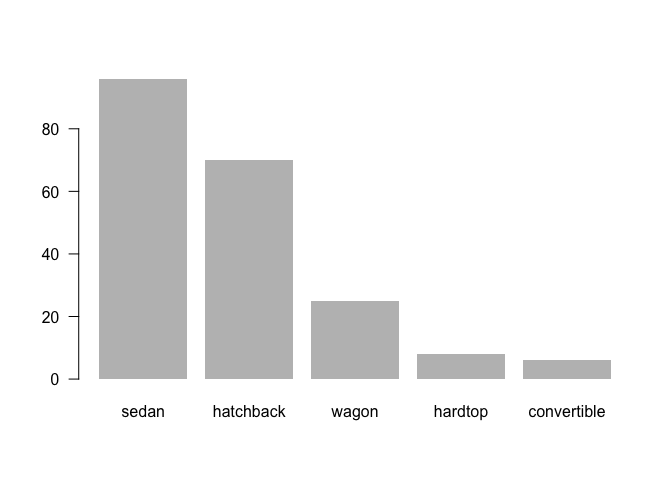

HW 1
================
Amy Kim

# 2 | Data import

## 2.1 | Importing data rame withread.csv()function

``` r
library(readr)
```

    ## Registered S3 methods overwritten by 'tibble':
    ##   method     from  
    ##   format.tbl pillar
    ##   print.tbl  pillar

``` r
read_csv("imports-85.data")
```

    ## Parsed with column specification:
    ## cols(
    ##   .default = col_character(),
    ##   `3` = col_double(),
    ##   `88.60` = col_double(),
    ##   `168.80` = col_double(),
    ##   `64.10` = col_double(),
    ##   `48.80` = col_double(),
    ##   `2548` = col_double(),
    ##   `130` = col_double(),
    ##   `9.00` = col_double(),
    ##   `21` = col_double(),
    ##   `27` = col_double()
    ## )

    ## See spec(...) for full column specifications.

    ## # A tibble: 204 x 26
    ##      `3` `?`   `alfa-romero` gas   std   two   convertible rwd   front `88.60`
    ##    <dbl> <chr> <chr>         <chr> <chr> <chr> <chr>       <chr> <chr>   <dbl>
    ##  1     3 ?     alfa-romero   gas   std   two   convertible rwd   front    88.6
    ##  2     1 ?     alfa-romero   gas   std   two   hatchback   rwd   front    94.5
    ##  3     2 164   audi          gas   std   four  sedan       fwd   front    99.8
    ##  4     2 164   audi          gas   std   four  sedan       4wd   front    99.4
    ##  5     2 ?     audi          gas   std   two   sedan       fwd   front    99.8
    ##  6     1 158   audi          gas   std   four  sedan       fwd   front   106. 
    ##  7     1 ?     audi          gas   std   four  wagon       fwd   front   106. 
    ##  8     1 158   audi          gas   turbo four  sedan       fwd   front   106. 
    ##  9     0 ?     audi          gas   turbo two   hatchback   4wd   front    99.5
    ## 10     2 192   bmw           gas   std   two   sedan       rwd   front   101. 
    ## # … with 194 more rows, and 16 more variables: `168.80` <dbl>, `64.10` <dbl>,
    ## #   `48.80` <dbl>, `2548` <dbl>, dohc <chr>, four <chr>, `130` <dbl>,
    ## #   mpfi <chr>, `3.47` <chr>, `2.68` <chr>, `9.00` <dbl>, `111` <chr>,
    ## #   `5000` <chr>, `21` <dbl>, `27` <dbl>, `13495` <chr>

``` r
#vector of column names
column_names<-c("symboling",
                "normalized_losses",
                "make",
                "fuel_type",
                "aspiration",
                "num_of_doors",
                "body_style",
                "drive_wheels",
                "engine_location",
                "wheel_base",
                "length",
                "width",
                "height",
                "curb_weight",
                "engine_type",
                "num_of_cylinders",
                "engine_size",
                "fuel_system",
                "bore",
                "stroke",
                "compression_ratio",
                "horsepower",
                "peak_rpm",
                "city_mpg",
                "highway_mpg",
                "price")

#vector with data types for each column
column_types <-c('integer',# symboling
                 'real',# normalized_losses
                 rep('character', 7),#'make'to'engine_location'
                 rep('real', 4),#'wheel_base'to'height'
                 'integer',# curb_weight
                 rep('character', 2),
                 'integer',
                 'character',
                 rep('real', 3),#'bore'to'compression_ratio'
                 rep('integer', 5)#'horsepower'to'price'
                 )
                 
# Data import with read.csv()
dat1 <-read.csv(file ='imports-85.data',header = FALSE,na.strings = "?",col.names = column_names,colClasses = column_types)

str(dat1, vec.len = 1)
```

    ## 'data.frame':    205 obs. of  26 variables:
    ##  $ symboling        : int  3 3 ...
    ##  $ normalized_losses: num  NA NA ...
    ##  $ make             : chr  "alfa-romero" ...
    ##  $ fuel_type        : chr  "gas" ...
    ##  $ aspiration       : chr  "std" ...
    ##  $ num_of_doors     : chr  "two" ...
    ##  $ body_style       : chr  "convertible" ...
    ##  $ drive_wheels     : chr  "rwd" ...
    ##  $ engine_location  : chr  "front" ...
    ##  $ wheel_base       : num  88.6 88.6 ...
    ##  $ length           : num  169 ...
    ##  $ width            : num  64.1 64.1 ...
    ##  $ height           : num  48.8 48.8 ...
    ##  $ curb_weight      : int  2548 2548 ...
    ##  $ engine_type      : chr  "dohc" ...
    ##  $ num_of_cylinders : chr  "four" ...
    ##  $ engine_size      : int  130 130 ...
    ##  $ fuel_system      : chr  "mpfi" ...
    ##  $ bore             : num  3.47 3.47 ...
    ##  $ stroke           : num  2.68 2.68 ...
    ##  $ compression_ratio: num  9 9 ...
    ##  $ horsepower       : int  111 111 ...
    ##  $ peak_rpm         : int  5000 5000 ...
    ##  $ city_mpg         : int  21 21 ...
    ##  $ highway_mpg      : int  27 27 ...
    ##  $ price            : int  13495 16500 ...

## 2.2 | Importing data frame with read\_csv() function

``` r
# Data import with read_csv()
dat <-read_csv(file ='imports-85.data',
               na ='?',
               col_names = column_names,
               col_types =list("symboling" =col_integer(),
                               "normalized_losses" =col_double(),
                               "make" =col_character(),
                               "fuel_type" =col_character(),
                               "aspiration" =col_character(),
                               "num_of_doors" =col_character(),
                               "body_style" =col_character(),
                               "drive_wheels" =col_character(),
                               "engine_location" =col_character(),
                               "wheel_base" =col_double(),
                               "length" =col_double(),
                               "width" =col_double(),
                               "height" =col_double(),
                               "curb_weight" =col_integer(),
                               "engine_type" =col_character(),
                               "num_of_cylinders" =col_character(),
                               "engine_size" =col_integer(),
                               "fuel_system" =col_character(),
                               "bore" =col_double(),
                               "stroke" =col_double(),
                               "compression_ratio" =col_double(),
                               "horsepower" =col_integer(),
                               "peak_rpm" =col_integer(),
                               "city_mpg" =col_integer(),
                               "highway_mpg" =col_integer(),
                               "price" =col_integer()))

str(dat, vec.len = 1)
```

    ## spec_tbl_df [205 × 26] (S3: spec_tbl_df/tbl_df/tbl/data.frame)
    ##  $ symboling        : int [1:205] 3 3 ...
    ##  $ normalized_losses: num [1:205] NA NA ...
    ##  $ make             : chr [1:205] "alfa-romero" ...
    ##  $ fuel_type        : chr [1:205] "gas" ...
    ##  $ aspiration       : chr [1:205] "std" ...
    ##  $ num_of_doors     : chr [1:205] "two" ...
    ##  $ body_style       : chr [1:205] "convertible" ...
    ##  $ drive_wheels     : chr [1:205] "rwd" ...
    ##  $ engine_location  : chr [1:205] "front" ...
    ##  $ wheel_base       : num [1:205] 88.6 88.6 ...
    ##  $ length           : num [1:205] 169 ...
    ##  $ width            : num [1:205] 64.1 64.1 ...
    ##  $ height           : num [1:205] 48.8 48.8 ...
    ##  $ curb_weight      : int [1:205] 2548 2548 ...
    ##  $ engine_type      : chr [1:205] "dohc" ...
    ##  $ num_of_cylinders : chr [1:205] "four" ...
    ##  $ engine_size      : int [1:205] 130 130 ...
    ##  $ fuel_system      : chr [1:205] "mpfi" ...
    ##  $ bore             : num [1:205] 3.47 3.47 ...
    ##  $ stroke           : num [1:205] 2.68 2.68 ...
    ##  $ compression_ratio: num [1:205] 9 9 ...
    ##  $ horsepower       : int [1:205] 111 111 ...
    ##  $ peak_rpm         : int [1:205] 5000 5000 ...
    ##  $ city_mpg         : int [1:205] 21 21 ...
    ##  $ highway_mpg      : int [1:205] 27 27 ...
    ##  $ price            : int [1:205] 13495 16500 ...
    ##  - attr(*, "spec")=
    ##   .. cols(
    ##   ..   symboling = col_integer(),
    ##   ..   normalized_losses = col_double(),
    ##   ..   make = col_character(),
    ##   ..   fuel_type = col_character(),
    ##   ..   aspiration = col_character(),
    ##   ..   num_of_doors = col_character(),
    ##   ..   body_style = col_character(),
    ##   ..   drive_wheels = col_character(),
    ##   ..   engine_location = col_character(),
    ##   ..   wheel_base = col_double(),
    ##   ..   length = col_double(),
    ##   ..   width = col_double(),
    ##   ..   height = col_double(),
    ##   ..   curb_weight = col_integer(),
    ##   ..   engine_type = col_character(),
    ##   ..   num_of_cylinders = col_character(),
    ##   ..   engine_size = col_integer(),
    ##   ..   fuel_system = col_character(),
    ##   ..   bore = col_double(),
    ##   ..   stroke = col_double(),
    ##   ..   compression_ratio = col_double(),
    ##   ..   horsepower = col_integer(),
    ##   ..   peak_rpm = col_integer(),
    ##   ..   city_mpg = col_integer(),
    ##   ..   highway_mpg = col_integer(),
    ##   ..   price = col_integer()
    ##   .. )

# 3 | Technical Questions about importing data

**Answer the following questions (using your own words). You do NOT need
to include anycommands.**

**a. If you don’t provide a vector of column names, what happens to the
column names ofthe imported data when you simply
invokeread.csv(‘imports-85.data’)?**

read.csv()will take the first row in a CSV file and use its values as
column names.

**b.If you don’t provide a vector of column names, what happens to the
column names of theimported data when you
invokeread.csv(‘imports-85.data’, header = FALSE)?**

read.csv() will name the columns asV1, V2, V3, ….

**c.When using the reading table functions, if you don’t specify how
missing values arecodified, what happens to the data type of those
columns that contain’?’, e.g.priceornum\_of\_doors?**

R will treat the data type of those columns as characters, and then
convert them into factors.

**d.Say you importimports-85.datain two different ways. In the first
option you importthe data without specifying the data type of each
column. In the second option you dospecify the data types. You may
wonder whether both options return a data frame ofthe same memory size.
You can actually use the functionobject.size()that providesan estimate
of the memory that is being used to store an R object. Why is the
dataframe imported in the second option bigger (in terms of bytes) than
the data frameimported in the first option?**

While importing the data without specifying the data type of each
column, the reading table functions will convert all character columns
as factors. Because factors are internally stored as integer vectors,
these will tend to occupy less memory.

**e.Say the objectdatis the data frame produced when
importingimports-85.data.What happens to the data values if you
convertdatas an R matrix?**

Converting datas an R matrix will produce a matrix object of character
values. Because dat contains some character columns, R will implictly
coerce all the values as characters(recall that matrices are atomic
structures).

# 4 | Practice base plotting

  - histogram ofpricewith colored bars.
  - boxplot ofhorsepowerin horizontal orientation.
  - barplot of the frequencies ofbody\_style, arranged in decreasing
    order.
  - stars()plot of vehicles with turboaspiration, using only variables
    wheel\_base,length,width,height, and price.

The creation of these plots was merely for exploratory purposes, and
with the intention that you played with base plots (and their
parameters). Simply plotting the graphs is NOT enough, your answer
should include a (somewhat brief) description. If you don’t
descriptions,then give half credit.

Keep in mind that in real life, sooner or later, you will have to
describe and explain your analysis to a client, a manager, your boss, or
any other audience. Even if the graphics are forexploratory purposes,
you should jot some notes in your code describing what’s going on.

  - histogram ofpricewith colored bars.

<!-- end list -->

``` r
hist(dat$price, col ='gray80')
```

<!-- -->

  - boxplot ofhorsepowerin horizontal orientation.

<!-- end list -->

``` r
boxplot(dat$horsepower, horizontal = TRUE)
```

<!-- -->

  - barplot of the frequencies ofbody\_style, arranged in decreasing
    order.

<!-- end list -->

``` r
body_style_freqs <-sort(table(dat$body_style), decreasing = TRUE)
barplot(body_style_freqs, las = 1, border = NA)
```

<!-- -->

  - stars()plot of vehicles with turboaspiration, using only variable
    swheel\_base,length,width,height, and price.

<!-- end list -->

``` r
turbo_aspiration <- dat$aspiration=='turbo'
turbo_vars <-c('wheel_base','length','width','height','price')
turbo_cars <- dat[turbo_aspiration, turbo_vars]
stars(turbo_cars, labels =rownames(dat)[turbo_aspiration],nrow = 5, key.loc =c(9, 13))
```

<!-- -->

# 5 | Summaries

**Use R code to answer the following questions:**

**a. What is the mean price of fuel\_type gas cars? And what is the mean
price of fuel\_type diesel cars? (removing missing values)**

``` r
# mean price of fuel-type gas
mean(dat$price[dat$fuel_type=='gas'], na.rm = TRUE)
```

    ## [1] 12916.41

``` r
# mean price of fuel-type diesel
mean(dat$price[dat$fuel_type=='diesel'], na.rm = TRUE)
```

    ## [1] 15838.15

**b. What is themakeof the car with twelve num\_of\_cylinders?**

``` r
#make of the car with twelve num_of_cylinders
dat$make[dat$num_of_cylinders=='twelve']
```

    ## [1] "jaguar"

**c. What is themakethat has the most diesel cars?**

``` r
# make that has the most diesel cars
diesel_freqs <-table(dat$make[dat$fuel_type=='diesel'])
most_diesel <-which.max(diesel_freqs)

names(most_diesel)
```

    ## [1] "peugot"

**d. What is thepriceof the car with the largest amount of horsepower?**

``` r
# price of the car with the largest amount of horsepower
max_hp <-max(dat$horsepower, na.rm = TRUE)
dat$price[which(dat$horsepower==max_hp)]
```

    ## [1] NA

``` r
# equivalently
dat$price[which.max(dat$horsepower)]
```

    ## [1] NA

**e. What is the bottom 10th percentile ofcity\_mpg?**

``` r
# bottom 10th percentile of city_mpg
quantile(dat$city_mpg, probs = 0.10)
```

    ## 10% 
    ##  17

**f. What is the top 10th percentile of highway\_mpg?**

``` r
# bottom 10th percentile of highway_mpg
quantile(dat$highway_mpg, probs = 0.90)
```

    ## 90% 
    ##  38

**g. What is the median price of those cars in the bottom 10th
percentile ofcity\_mpg?**

``` r
# median price of those cars in the bottom 10th percentile of city_mpg
city_mpg_10perc <- dat$city_mpg<= quantile(dat$city_mpg, probs = 0.10)
median(dat$price[city_mpg_10perc], na.rm = TRUE)
```

    ## [1] 32250

# 6 | Technical Questions about data frames

**Answer the following questions (using your own words). You do NOT need
to include any commands.**

**a. What happens when you use the
dollar\(operator on a data frame, attempting to use the name of a column that does not exist? For example: dat\)xyz
where there is nocolumn named xyz.**

R will return aNULLvalue

**b.Which of the following commands fails to return the vector mpg which
is a column in the built-in data
rfamemtcars:**

1.mtcars\(mpg 2.mtcars[ ,1] 3.mtcars[[1]] 4.mtcars[ ,mpg] 5.mtcars[["mpg"]] 6.mtcars\)“mpg”
7.mtcars\[ ,“mpg”\]

The command mtcars\[ ,mpg\] fails to return the vector mpg.

**c. Based on your answer for part (b), what is the reason that makes
such command to fail?**

Because the name of the column mpg is not quoted. So R will look for an
object mpg that does not exist.

**d. Can you include an R list as a “column” of a data frame? YES or NO,
and why.**

Keep in mind that a data frame is actually list. So, under some special
circumstances, youcan include a list as a column of a data frame. The
main requirement is that the added listhas the same number of elements
as the other columns (or that the elements of the addedlist get recycled
to match the length of the other columns).

**e. What happens when you applyas.list() to a data frame?
e.g. as.list(mtcars)**

When applyingas.list() to a data frame, R will return a list with as
many elements as columns in the data frame.

**f.Consider the command: abc \<- as.list(mtcars). What function(s) can
you use toconvert the objectabcinto a data frame?**

You can use data.frame(abc) or as.data.frame(abc)to convertabcinto a
data frame.

# 7 | Correlations of quantitative variables

Except forsymboling and normalized\_losses, use the rest of the
quantitative variables both integer and real) to compute a matrix of
correlations between such variables. See how to use the function
na.omit()to create a new data frame with the quantitative variables,
that does not contain missing values. Call this data frame qdat.
Hint:see the function cor().

``` r
#vector of quantitative variable names
quantitative <-c("wheel_base",
                 "length",
                 "width",
                 "height",
                 "curb_weight",
                 "engine_size",
                 "bore",
                 "stroke",
                 "compression_ratio",
                 "horsepower",
                 "peak_rpm",
                 "city_mpg",
                 "highway_mpg",
                 "price")

# omit missing values
qdat <-na.omit(dat[ ,quantitative])
# martix of correlations
correlations <-cor(qdat)
round(correlations, 3)
```

    ##                   wheel_base length  width height curb_weight engine_size
    ## wheel_base             1.000  0.879  0.819  0.593       0.783       0.570
    ## length                 0.879  1.000  0.858  0.496       0.882       0.687
    ## width                  0.819  0.858  1.000  0.316       0.867       0.740
    ## height                 0.593  0.496  0.316  1.000       0.308       0.031
    ## curb_weight            0.783  0.882  0.867  0.308       1.000       0.858
    ## engine_size            0.570  0.687  0.740  0.031       0.858       1.000
    ## bore                   0.498  0.609  0.544  0.189       0.646       0.583
    ## stroke                 0.172  0.119  0.186 -0.056       0.173       0.212
    ## compression_ratio      0.248  0.160  0.191  0.261       0.155       0.025
    ## horsepower             0.376  0.584  0.617 -0.084       0.760       0.843
    ## peak_rpm              -0.352 -0.281 -0.252 -0.264      -0.279      -0.219
    ## city_mpg              -0.499 -0.690 -0.647 -0.102      -0.772      -0.711
    ## highway_mpg           -0.566 -0.719 -0.692 -0.151      -0.813      -0.732
    ## price                  0.586  0.695  0.754  0.138       0.836       0.889
    ##                     bore stroke compression_ratio horsepower peak_rpm city_mpg
    ## wheel_base         0.498  0.172             0.248      0.376   -0.352   -0.499
    ## length             0.609  0.119             0.160      0.584   -0.281   -0.690
    ## width              0.544  0.186             0.191      0.617   -0.252   -0.647
    ## height             0.189 -0.056             0.261     -0.084   -0.264   -0.102
    ## curb_weight        0.646  0.173             0.155      0.760   -0.279   -0.772
    ## engine_size        0.583  0.212             0.025      0.843   -0.219   -0.711
    ## bore               1.000 -0.067             0.003      0.569   -0.278   -0.592
    ## stroke            -0.067  1.000             0.200      0.100   -0.068   -0.028
    ## compression_ratio  0.003  0.200             1.000     -0.214   -0.445    0.331
    ## horsepower         0.569  0.100            -0.214      1.000    0.106   -0.834
    ## peak_rpm          -0.278 -0.068            -0.445      0.106    1.000   -0.069
    ## city_mpg          -0.592 -0.028             0.331     -0.834   -0.069    1.000
    ## highway_mpg       -0.600 -0.036             0.268     -0.813   -0.017    0.972
    ## price              0.547  0.094             0.070      0.811   -0.104   -0.703
    ##                   highway_mpg  price
    ## wheel_base             -0.566  0.586
    ## length                 -0.719  0.695
    ## width                  -0.692  0.754
    ## height                 -0.151  0.138
    ## curb_weight            -0.813  0.836
    ## engine_size            -0.732  0.889
    ## bore                   -0.600  0.547
    ## stroke                 -0.036  0.094
    ## compression_ratio       0.268  0.070
    ## horsepower             -0.813  0.811
    ## peak_rpm               -0.017 -0.104
    ## city_mpg                0.972 -0.703
    ## highway_mpg             1.000 -0.716
    ## price                  -0.716  1.000

Read the post *Correlogramsby* Xia Liu, available in the file
correlograms-xia-liu, inside the folder papers of the course github
repo:

Based on the matrix of correlations between the quantitative variables,
plot two correlograms,and comment on the patterns and values that you
observe.

``` r
library(corrplot)
```

    ## corrplot 0.84 loaded

``` r
corrplot(correlations, method ='circle')
```

<!-- -->

``` r
corrplot(correlations, method ='color')
```

<!-- -->

# 8 | Principal Components Analysis

## 8.1 | Run PCA

  - Use prcomp() to perform a principal components analysis on qdat; use
    the argument scale. = TRUE to carry out PCA on standardized data.

In theory, your qdat object should be the data frame containing the
quantitative variables, NOT the correlation matrix of such variables.

However, many students were confused about this, and they have qdat
defined as the correlation matrix.

As a unique exception, we will accept valid answer of PCA aaplied on the
correlation matrix. But keep in mind that the answer key does not show
the output based on the correlation data matrix.

``` r
pca <-prcomp(qdat, scale. = TRUE)
```

  - Examine the eigenvalues and determine the proportion of variation
    that is “captured” by the first three components.

<!-- end list -->

``` r
# table of eigenvalues
eigenvalues <-data.frame(eigenvalues = 
                           pca$sdev^2,
                         proportion = pca$sdev^2/ sum(pca$sdev^2),
                         cumulative =cumsum(pca$sdev^2)/ sum(pca$sdev^2))
eigenvalues
```

    ##    eigenvalues  proportion cumulative
    ## 1   7.53181553 0.537986823  0.5379868
    ## 2   2.27923094 0.162802210  0.7007890
    ## 3   1.21613308 0.086866648  0.7876557
    ## 4   0.90961519 0.064972514  0.8526282
    ## 5   0.60894217 0.043495870  0.8961241
    ## 6   0.41570430 0.029693164  0.9258172
    ## 7   0.32059895 0.022899925  0.9487172
    ## 8   0.27014548 0.019296106  0.9680133
    ## 9   0.12030933 0.008593524  0.9766068
    ## 10  0.11060092 0.007900066  0.9845068
    ## 11  0.08158813 0.005827724  0.9903346
    ## 12  0.06422049 0.004587178  0.9949218
    ## 13  0.05139667 0.003671191  0.9985929
    ## 14  0.01969881 0.001407058  1.0000000

The first three components capture about 78.8 % of the total variation.

## 8.2 | PCA plot of vehicles, and PCA plot of variables

  - Use the first two components to graph a scatterplot of the vehicles
    (do not use “ggplot2”functions).

<!-- end list -->

``` r
# plot of variables
plot(pca$x[,1], pca$x[,2], type ='n')
abline(h = 0, v = 0, col ='gray80')
text(pca$x[,1], pca$x[,2], labels = 1:nrow(qdat))
```

<!-- -->

  - Use the first two loadings (i.e. eigenvectors) to graph the
    variables.

<!-- end list -->

``` r
# plot of PCs
plot(pca$rotation[,1], pca$rotation[,2])
abline(h = 0, v = 0, col ='gray80')
text(pca$rotation[,1], pca$rotation[,2], labels =colnames(qdat))
```

<!-- -->

  - Optionally, you can call biplot() of the“prcomop”object to get a
    simultaneous plot of both the vehicles and the variables.

<!-- end list -->

``` r
#biplot
biplot(pca)
abline(v = 0, h = 0, col ='gray80')
```

<!-- -->

Unfortunately, the data set does not contain the names of the vehicles,
so the interpretation is a bit limited.
