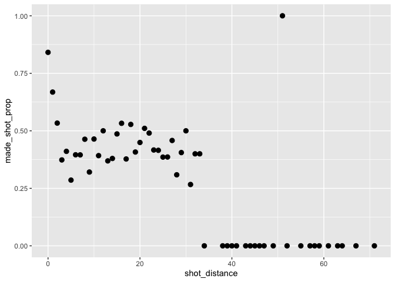
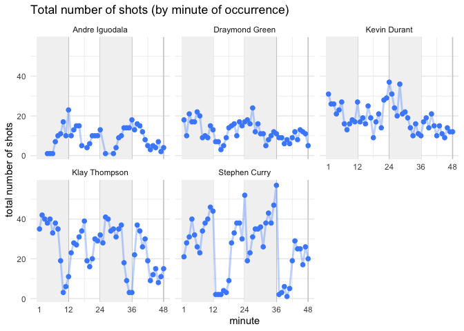

hw2
================

## 5.1 | Total Shots by Player

``` r
library(dplyr)
```

    ## Registered S3 methods overwritten by 'tibble':
    ##   method     from  
    ##   format.tbl pillar
    ##   print.tbl  pillar

    ## 
    ## Attaching package: 'dplyr'

    ## The following objects are masked from 'package:stats':
    ## 
    ##     filter, lag

    ## The following objects are masked from 'package:base':
    ## 
    ##     intersect, setdiff, setequal, union

``` r
shots_data <- read.csv("/Users/akii_my/Desktop/school/stat133/hw/hw2/data/shots-data.csv")

total_shots_by_player <- shots_data %>%
  group_by(name)%>%
  select(name) %>%
  summarise(total =n()) %>%
  arrange(desc(total))

total_shots_by_player
```

    ## # A tibble: 5 x 2
    ##   name           total
    ##   <chr>          <int>
    ## 1 Stephen Curry   1250
    ## 2 Klay Thompson   1220
    ## 3 Kevin Durant     915
    ## 4 Draymond Green   578
    ## 5 Andre Iguodala   371

## 5.2 | Effective Shooting Percentage

### Effective Shooting Perentage Player

``` r
shots_data %>%
  filter(shot_made_flag=="made_shot" | shot_made_flag=="missed_shot") %>%
  group_by(name)%>%
  summarise(total = n()) %>% 
  ungroup() %>% 
  arrange(name) %>%
  data.frame -> data_1

shots_data %>%
  filter(shot_made_flag=="made_shot") %>%
  group_by(name)%>%
  summarise(made = n()) %>% 
  ungroup() %>% 
  arrange(name) %>%
  data.frame -> data_2

shots_data %>%
  filter(shot_made_flag=="missed_shot") %>%
  group_by(name)%>%
  summarise(missed = n()) %>% 
  ungroup() %>% 
  arrange(name) %>%
  data.frame -> data_3
perc_made <- (data_2$made/data_1$total) * 100 
cbind(data_1, select(data_2, made), perc_made) -> effective_shooting
arrange(effective_shooting, desc(perc_made))
```

    ##             name total made perc_made
    ## 1   Kevin Durant   915  495  54.09836
    ## 2 Andre Iguodala   371  192  51.75202
    ## 3  Klay Thompson  1220  575  47.13115
    ## 4  Stephen Curry  1250  584  46.72000
    ## 5 Draymond Green   578  245  42.38754

### Effective Shooting Percentage Player

``` r
shots_data %>%
  filter((shot_type=="2PT Field Goal" & shot_made_flag=="missed_shot") | (shot_type=="2PT Field Goal" & shot_made_flag=="made_shot")) %>%
  group_by(name)%>%
  summarise(total_2PT = n()) %>% 
  ungroup() %>% 
  arrange(name) %>%
  data.frame -> data_1_2pt


shots_data %>%
  filter((shot_type=="2PT Field Goal" & shot_made_flag=="made_shot")) %>%
  group_by(name)%>%
  summarise(made = n()) %>% 
  ungroup() %>% 
  arrange(name) %>%
  data.frame -> data_2_2pt


perc_made_2pt <- (data_2_2pt$made/data_1_2pt$total) * 100
cbind(data_1_2pt, select(data_2_2pt, made), perc_made_2pt) -> effective_shooting_2pt
arrange(effective_shooting_2pt, desc(perc_made_2pt))
```

    ##             name total_2PT made perc_made_2pt
    ## 1 Andre Iguodala       210  134      63.80952
    ## 2   Kevin Durant       643  390      60.65319
    ## 3  Stephen Curry       563  304      53.99645
    ## 4  Klay Thompson       640  329      51.40625
    ## 5 Draymond Green       346  171      49.42197

### Effective Shooting Percentage Player

``` r
shots_data %>%
  filter((shot_type=="3PT Field Goal" & shot_made_flag=="missed_shot") | (shot_type=="3PT Field Goal" & shot_made_flag=="made_shot")) %>%
  group_by(name)%>%
  summarise(total_3PT = n()) %>% 
  ungroup() %>% 
  arrange(name) %>%
  data.frame -> data_1_3pt


shots_data %>%
  filter((shot_type=="3PT Field Goal" & shot_made_flag=="made_shot")) %>%
  group_by(name)%>%
  summarise(made = n()) %>% 
  ungroup() %>% 
  arrange(name) %>%
  data.frame -> data_2_3pt


perc_made_3pt <- (data_2_3pt$made/data_1_3pt$total) * 100
cbind(data_1_3pt, select(data_2_3pt, made), perc_made_3pt) -> effective_shooting_3pt
arrange(effective_shooting_3pt, desc(perc_made_3pt))
```

    ##             name total_3PT made perc_made_3pt
    ## 1  Klay Thompson       580  246      42.41379
    ## 2  Stephen Curry       687  280      40.75691
    ## 3   Kevin Durant       272  105      38.60294
    ## 4 Andre Iguodala       161   58      36.02484
    ## 5 Draymond Green       232   74      31.89655

# 6 | Shooting Distance

## 6.1 | Dplyr Table

``` r
shots_data %>%
  group_by(shot_distance)%>%
  select(shot_distance, shot_made_flag) %>%
  summarise(
    total_shots = n(),
    made_shots = sum(shot_made_flag == "made_shot")) %>%
  mutate(made_shot_prop = made_shots / total_shots) %>%
  select(shot_distance, made_shot_prop)
```

    ## # A tibble: 56 x 2
    ##    shot_distance made_shot_prop
    ##            <int>          <dbl>
    ##  1             0          0.841
    ##  2             1          0.668
    ##  3             2          0.534
    ##  4             3          0.373
    ##  5             4          0.411
    ##  6             5          0.286
    ##  7             6          0.396
    ##  8             7          0.395
    ##  9             8          0.463
    ## 10             9          0.321
    ## # … with 46 more rows

## 6.2 | ggplot

``` r
library(ggplot2)

shot_distance_table <- data.frame(
      shots_data %>%
      group_by(shot_distance) %>%
      select(shot_distance, shot_made_flag) %>%
      summarise(made_shot_prop = 
                  (sum(shot_made_flag == 'made_shot'))/
                  (sum(shot_made_flag == 'made_shot'|shot_made_flag == 'missed_shot'))
                )
)

ggplot(shot_distance_table, aes(x=shot_distance, y=made_shot_prop)) + geom_point(size=4, shape=20)
```

<!-- -->

I can observe that most of the points are below 100 on
made\_shot\_propand the graph itself is a decreasing graph overall.
There are outliers such as the first 3 points or the points between 20
and 30 on shotdistance. It can be seen that after 30, the shots made
decreases dramatically and hits almost 0 from there. It cannot be said
that the shorter the didstance, the more effective the shots becuase the
number of shots taken between 20 and 30 are higher in general than the
ones from 5 to 20, making the statement false. I guesstimate that after
the shot distance of 35, the chance of making successful shot is
basically null because after the point, the number of successful shots
become
0.

``` r
shot_distance_table$shot_distance[shot_distance_table$made_shot_prop >= 0.50]
```

    ## [1]  0  1  2 12 16 18 21 30 51

``` r
outlier_shot <- shot_distance_table %>%
  filter(shot_distance > 40) %>%
  filter(made_shot_prop == 1)

outlier_shot$shot_distance
```

    ## [1] 51

The distances that tend to have a percentage of 50% or more is 0, 1, 12,
16, 18, 21, 30, and 51. There is also an atypical (outlier) shot
successfully made from 51 feet.

# Total number of shots by minutes of occurrence

``` r
shots_in_minute <- shots_data %>%
  group_by(name, minute) %>%
  summarise(number_shots = n())
```

    ## `summarise()` has grouped output by 'name'. You can override using the `.groups` argument.

``` r
shots_in_minute
```

    ## # A tibble: 233 x 3
    ## # Groups:   name [5]
    ##    name           minute number_shots
    ##    <chr>           <int>        <int>
    ##  1 Andre Iguodala      4            1
    ##  2 Andre Iguodala      5            1
    ##  3 Andre Iguodala      6            1
    ##  4 Andre Iguodala      7            7
    ##  5 Andre Iguodala      8           10
    ##  6 Andre Iguodala      9           11
    ##  7 Andre Iguodala     10           17
    ##  8 Andre Iguodala     11           10
    ##  9 Andre Iguodala     12           23
    ## 10 Andre Iguodala     13           10
    ## # … with 223 more rows

``` r
shots_in_mn_plot <- ggplot(shots_in_minute,
                           aes(x = minute, y = number_shots)) +
  geom_vline(xintercept = c(12, 24, 36, 48), color = 'gray80') +
  scale_x_continuous(breaks = c(1, 12, 24, 36, 48)) +
  ylab('total number of shots') +
  geom_rect(aes(xmin = 0, xmax = 12, ymin = -Inf, ymax = Inf),
            fill = "gray95") +
  geom_rect(aes(xmin = 24, xmax = 36, ymin = -Inf, ymax = Inf),
            fill = "gray95") +
  theme_minimal() +
  geom_path(color = '#498dfc55', size = 1) +
  geom_point(color = "#498dfc", size = 2) +
  facet_wrap(~ name) +
  ggtitle('Total number of shots (by minute of occurrence)')

shots_in_mn_plot 
```

<!-- -->
