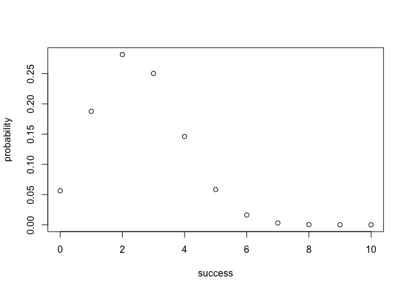
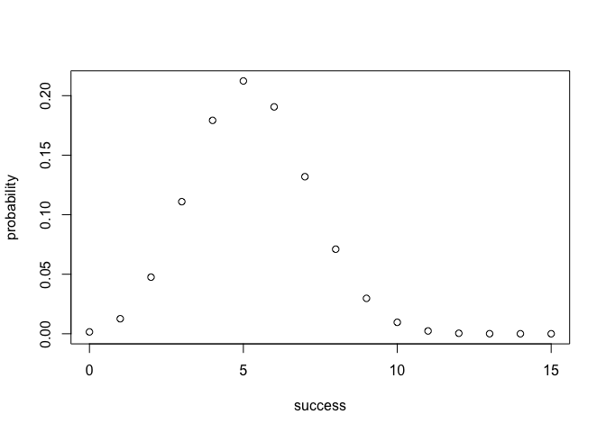

HW 3: Pipes and Programming Basics
================

# Pipelines and Redirection

``` bash
touch README.md
mkdir code
mkdir images

curl -O https://raw.githubusercontent.com/ucb-stat133/stat133-spring-2018/master/data/nba2017-roster.csv

#2.1
cut -d "," -f 2 nba2017-roster.csv | tail +2 | sort | uniq | head -n 5 > team-names.txt
head team-names.txt

#2.2
cut -d "," -f 3 nba2017-roster.csv | tail +2 | sort | uniq | head -n 5 > position-names.txt
head position-names.txt

#2.3
cut -d "," -f 7 nba2017-roster.csv | tail +2 | sort -n | uniq -c | head -n 5 > experience-counts.txt
head experience-counts.txt

#2.4
grep -e LAC -e team nba2017-roster.csv > LAC.csv
cat LAC.csv

#2.5
grep -e LAL nba2017-roster.csv | cut -d "," -f 6 | tail +2 | sort -n | uniq -c > LAL.csv
cat LAL.csv

#2.6 
grep 'CLE' nba2017-roster.csv | wc -l


#2.7
grep -e GSW -e team nba2017-roster.csv | cut -d "," -f 1,4,5 > gsw-height-weight.csv
cat gsw-height-weight.csv

#2.8
(cut -d "," -f 1,8 nba2017-roster.csv | grep salary & sort -k 8 -n -r -t "," nba2017-roster.csv | cut -d "," -f 1,8 | head -n 10) > top10-salaries.csv
cat top10-salaries.csv


rm team-names.txt
rm position-names.txt
rm experience-counts.txt
```

    ## mkdir: code: File exists
    ## mkdir: images: File exists
    ##   % Total    % Received % Xferd  Average Speed   Time    Time     Time  Current
    ##                                  Dload  Upload   Total   Spent    Left  Speed
    ##   0     0    0     0    0     0      0      0 --:--:-- --:--:-- --:--:--     0  0     0    0     0    0     0      0      0 --:--:-- --:--:-- --:--:--     0100 20751  100 20751    0     0  77141      0 --:--:-- --:--:-- --:--:-- 76855
    ## "ATL"
    ## "BOS"
    ## "BRK"
    ## "CHI"
    ## "CHO"
    ## "C"
    ## "PF"
    ## "PG"
    ## "SF"
    ## "SG"
    ##   80 0
    ##   52 1
    ##   46 2
    ##   36 3
    ##   35 4
    ## "player","team","position","height","weight","age","experience","salary"
    ## "Alan Anderson","LAC","SF",78,220,34,7,1315448
    ## "Austin Rivers","LAC","SG",76,200,24,4,1.1e+07
    ## "Blake Griffin","LAC","PF",82,251,27,6,20140838
    ## "Brandon Bass","LAC","PF",80,250,31,11,1551659
    ## "Brice Johnson","LAC","PF",82,230,22,0,1273920
    ## "Chris Paul","LAC","PG",72,175,31,11,22868828
    ## "DeAndre Jordan","LAC","C",83,265,28,8,21165675
    ## "Diamond Stone","LAC","C",83,255,19,0,543471
    ## "J.J. Redick","LAC","SG",76,190,32,10,7377500
    ## "Jamal Crawford","LAC","SG",77,200,36,16,13253012
    ## "Luc Mbah a Moute","LAC","SF",80,230,30,8,2203000
    ## "Marreese Speights","LAC","C",82,255,29,8,1403611
    ## "Paul Pierce","LAC","SF",79,235,39,18,3500000
    ## "Raymond Felton","LAC","PG",73,205,32,11,1551659
    ## "Wesley Johnson","LAC","SF",79,215,29,6,5628000
    ##    1 19
    ##    1 20
    ##    2 22
    ##    3 24
    ##    2 25
    ##    2 30
    ##    2 31
    ##    1 37
    ##       15
    ## "player","height","weight"
    ## "Andre Iguodala",78,215
    ## "Damian Jones",84,245
    ## "David West",81,250
    ## "Draymond Green",79,230
    ## "Ian Clark",75,175
    ## "James Michael McAdoo",81,230
    ## "JaVale McGee",84,270
    ## "Kevin Durant",81,240
    ## "Kevon Looney",81,220
    ## "Klay Thompson",79,215
    ## "Matt Barnes",79,226
    ## "Patrick McCaw",79,185
    ## "Shaun Livingston",79,192
    ## "Stephen Curry",75,190
    ## "Zaza Pachulia",83,270
    ## "player","salary"
    ## "LeBron James",30963450
    ## "Russell Westbrook",26540100
    ## "Mike Conley",26540100
    ## "Kevin Durant",26540100
    ## "James Harden",26540100
    ## "DeMar DeRozan",26540100
    ## "Al Horford",26540100
    ## "Carmelo Anthony",24559380
    ## "Damian Lillard",24328425
    ## "Dwyane Wade",23200000

# Binomial Probability Functions

``` r
#under R script file in code/ folder
```

# Rmd File

``` r
#1 Assume that the "successful" event is getting a "six" when rolling a die. Consider rolling a fair die 10 times. Use bin_probability() to find the probability of getting exactly 3 sixes.
source('./code/binomial-functions.R')
bin_probability(10,3,(1/6))
```

    ## [1] 0.1550454

``` r
#2 Use bin_distribution() to obtain the distribution of the number of °∞sixes°± when rolling a loaded die 10 times, in which the number "six" has probability of 0.25. Make a plot of this distribution.
z <- bin_distribution(10, 0.25)
plot(z)
```

<!-- -->

``` r
#3 Use bin_probability(), and a for loop, to obtain the probability of getting more than 3 heads in 5 tosses with a biased coin of 35% chance of heads.
j = 0
answer <- for(i in 4:5){
  j <- j + bin_probability(5,i,0.35)
}
j
```

    ## [1] 0.0540225

``` r
#4 Use bin_distribution() to obtain the probability distribution of the number of heads when tossing a loaded coin 15 times, with 35% chance of heads. Make a plot of this distribution.
w <- bin_distribution(trials = 15, prob = 0.35)
plot(w)
```

<!-- -->
