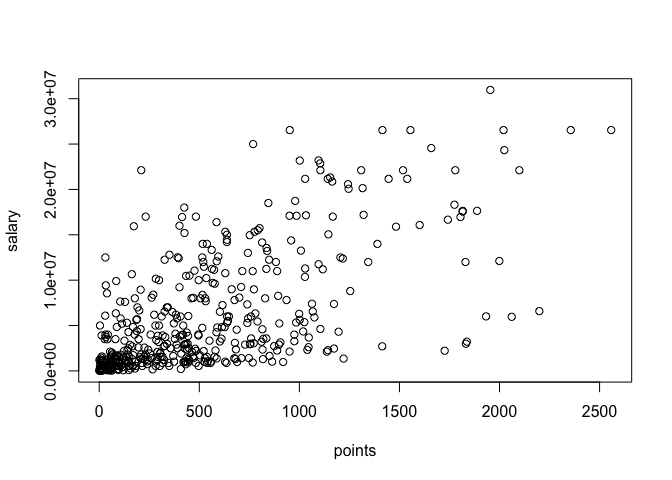
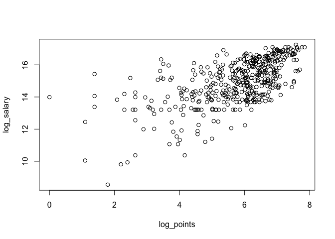
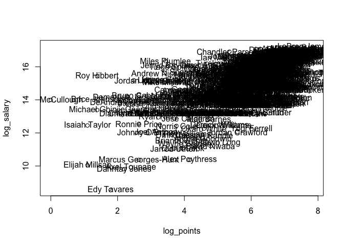
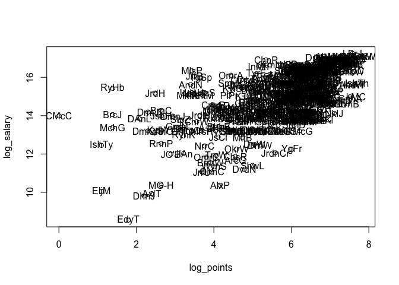
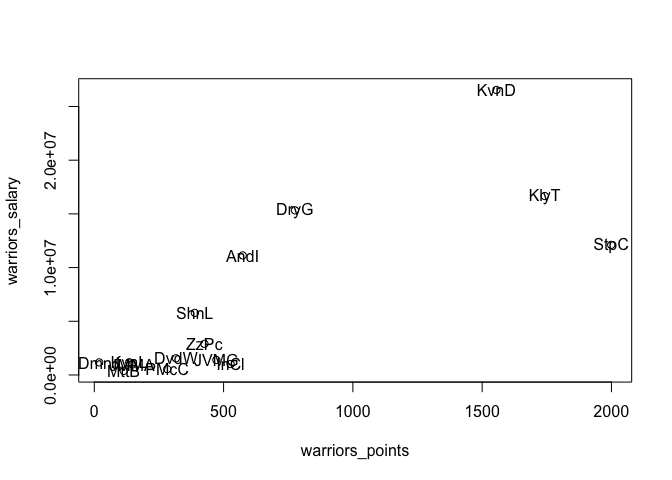
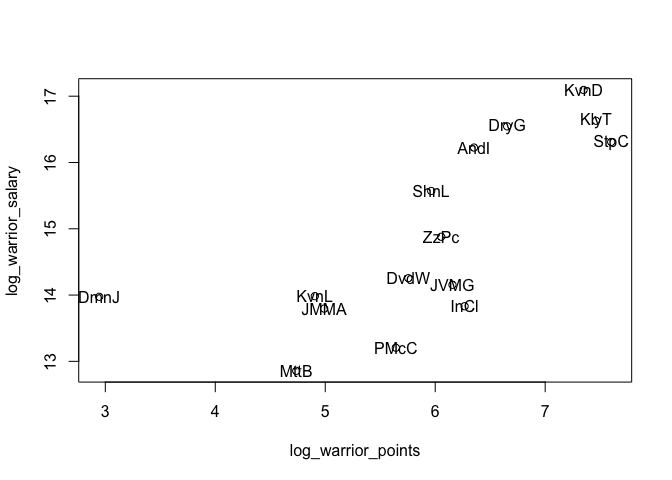
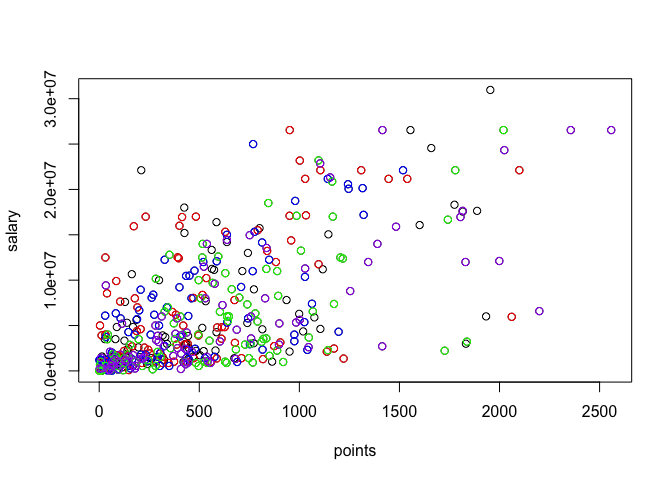
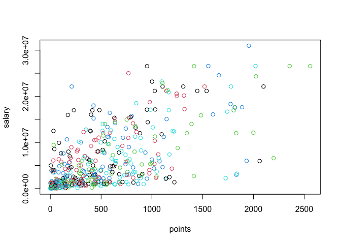
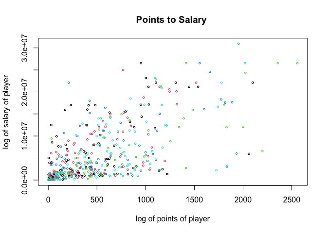

Lab 2: Vectors and other data structures
================
Amy Kim

# Getting the Data File

In this lab, you are going to work with a handful of variables about NBA
players from the regular season 2016-2017:

  - player: name of player.
  - team: team name abbreviation.
  - position: player position.
  - age: age of player.
  - experience: years of experience in NBA.
  - salary: salary (in dollars).
  - scored: total scored points.
  - points1: number of free throws, worth 1 point each.
  - points2: number of 2-point field goals, worth 2 points each.
  - points3: number of 3-point field goals, worth 3 points each.

The data is in the file nba2017-salary-points.RData, located in the
data/ folder of this github repository. The original source of the data
is the website www.basketball-reference.com

Open a new session in Rstudio, and make sure you have a clean workspace
by typing this command on the console:

``` r
# remove existing objects
rm(list = ls())
```

You can download the .RData file to your working directory, and then
load() it with the code below. Do NOT include these commands in your
source Rmd file; simply type them directly on the console:

``` r
# download RData file into your working directory
#rdata <- "https://github.com/ucb-stat133/stat133-fall-2017/raw/master/data/nba2017-salary-points.RData"
#download.file(url = rdata, destfile = 'nba2017-salary-points.RData')
```

## What’s happening in the code above?

The function download.file() allows you to download any type of file
from the Web. In this case you are downloading the file called
nba2017-salary-points.RData which is located in the github repository of
the course. This file is a binary file. To be more precise, the file
extension .RData is the default extension used by R for its binary
native format.

Where does the file get downloaded? Bby default, the file
nba2017-salary-points.RData gets downloaded to your working directory.
If you are curious about what is the current directory to which R is
paying attention to, simply type the function getwd()—which stands for
get the working directory.

If you want to specify a specific location for the downloaded file, then
modify the destfile parameter. For instance, if you are using Mac, and
you want the file to be downloaded to your desktop, you can use:

``` r
# download RData file to your Desktop (assuming you use Mac)
#rdata <- "https://github.com/ucb-stat133/stat133-fall-2017/raw/master/data/nba2017-salary-points.RData"
#download.file(url = rdata, destfile = '~/Desktop/nba2017-salary-points.RData')
```

## Loading the data file

To load or import the contents of the binary file into your R session
you use load(). This function allows you to import R binary files. This
time, include the code below in your Rmd file:

``` r
# load data in your R session
load('nba2017-salary-points.RData')
```

Note: the code above will only work as long as your Rmd file lives in
the same directory of the .RData file. So far I’m assuming that you have
both files in the working directory. If you run into problems, ask the
GSI or any of the lab assistants.

Once you imported (or loaded) the data, use the function ls() which
allows you to list all the available R objects:

``` r
# list the available objects with ls()
ls()
```

    ## [1] "player"   "points"   "points1"  "points2"  "points3"  "position" "salary"  
    ## [8] "team"

Check that the following objects are available in your session:

  - player
  - team
  - position
  - salary
  - etc

## About .RData files

Most of the data sets you are going to be working with in real life are
going to be stored in some sort of text file. So you probably won’t be
handling many R binary files (i.e. .RData files). However, R binary
files are an interesting option for saving intermediate results, and/or
for saving R objects (as R objects).

## Inspecting the data objects

Once you have some data objects to work with, the first step is to
inspect some of their characteristics. R has various functions that
allow you to examine objects:

  - typeof() type of storage of any object
  - class() gives you the class of the object
  - str() displays the structure of an object in a compact way
  - mode() gives the data type (as used in R)
  - object.size() gives an estimate of the memory space used by an
    object
  - length() gives the length (i.e. number of elements)
  - head() take a peek at the first elements
  - tail() take a peek at the last elements
  - summary() shows a summary of a given object

### Your turn:

  - Use length(), head(), tail(), and summary() to start exploring the
    content of the loaded objects.

<!-- end list -->

``` r
length(player)
```

    ## [1] 441

``` r
length(points)
```

    ## [1] 441

``` r
length(position)
```

    ## [1] 441

``` r
length(points)
```

    ## [1] 441

``` r
length(points1)
```

    ## [1] 441

``` r
length(points2)
```

    ## [1] 441

``` r
length(points3)
```

    ## [1] 441

``` r
length(salary)
```

    ## [1] 441

``` r
length(team)
```

    ## [1] 441

``` r
head(player)
```

    ## [1] "Al Horford"        "Amir Johnson"      "Avery Bradley"    
    ## [4] "Demetrius Jackson" "Gerald Green"      "Isaiah Thomas"

``` r
head(points)
```

    ## [1]  952  520  894   10  262 2199

``` r
head(position)
```

    ## [1] "C"  "PF" "SG" "PG" "SF" "PG"

``` r
head(points)
```

    ## [1]  952  520  894   10  262 2199

``` r
head(points1)
```

    ## [1] 108  67  68   3  33 590

``` r
head(points2)
```

    ## [1] 293 186 251   2  56 437

``` r
head(points3)
```

    ## [1]  86  27 108   1  39 245

``` r
head(salary)
```

    ## [1] 26540100 12000000  8269663  1450000  1410598  6587132

``` r
head(team)
```

    ## [1] BOS BOS BOS BOS BOS BOS
    ## 30 Levels: ATL BOS BRK CHI CHO CLE DAL DEN DET GSW HOU IND LAC LAL MEM ... WAS

``` r
tail(player)
```

    ## [1] "Leandro Barbosa" "Marquese Chriss" "Ronnie Price"    "T.J. Warren"    
    ## [5] "Tyler Ulis"      "Tyson Chandler"

``` r
tail(points)
```

    ## [1] 419 753  14 951 444 397

``` r
tail(position)
```

    ## [1] "SG" "PF" "PG" "SF" "PG" "C"

``` r
tail(points)
```

    ## [1] 419 753  14 951 444 397

``` r
tail(points1)
```

    ## [1]  40 113   3 119  55  91

``` r
tail(points2)
```

    ## [1] 137 212   1 377 163 153

``` r
tail(points3)
```

    ## [1] 35 72  3 26 21  0

``` r
tail(salary)
```

    ## [1]  4000000  2941440   282595  2128920   918369 12415000

``` r
tail(team)
```

    ## [1] PHO PHO PHO PHO PHO PHO
    ## 30 Levels: ATL BOS BRK CHI CHO CLE DAL DEN DET GSW HOU IND LAC LAL MEM ... WAS

``` r
summary(player)
```

    ##    Length     Class      Mode 
    ##       441 character character

``` r
summary(points)
```

    ##    Min. 1st Qu.  Median    Mean 3rd Qu.    Max. 
    ##     0.0   156.0   432.0   546.6   780.0  2558.0

``` r
summary(position)
```

    ##    Length     Class      Mode 
    ##       441 character character

``` r
summary(points)
```

    ##    Min. 1st Qu.  Median    Mean 3rd Qu.    Max. 
    ##     0.0   156.0   432.0   546.6   780.0  2558.0

``` r
summary(points1)
```

    ##    Min. 1st Qu.  Median    Mean 3rd Qu.    Max. 
    ##    0.00   21.00   58.00   92.47  120.00  746.00

``` r
summary(points2)
```

    ##    Min. 1st Qu.  Median    Mean 3rd Qu.    Max. 
    ##     0.0    39.0   111.0   152.5   213.0   730.0

``` r
summary(points3)
```

    ##    Min. 1st Qu.  Median    Mean 3rd Qu.    Max. 
    ##    0.00    3.00   32.00   49.71   78.00  324.00

``` r
summary(salary)
```

    ##     Min.  1st Qu.   Median     Mean  3rd Qu.     Max. 
    ##     5145  1286160  3500000  6187014  9250000 30963450

``` r
summary(team)
```

    ## ATL BOS BRK CHI CHO CLE DAL DEN DET GSW HOU IND LAC LAL MEM MIA MIL MIN NOP NYK 
    ##  14  15  15  15  15  15  15  15  15  15  14  14  15  15  15  14  14  14  14  15 
    ## OKC ORL PHI PHO POR SAC SAS TOR UTA WAS 
    ##  15  15  15  15  14  15  15  15  15  14

  - Do all the objects have the same length? Yes. Length of 441.

  - Are there missing values, i.e. NA, in any of the objects?

<!-- end list -->

``` r
sum(is.na(player))
```

    ## [1] 0

``` r
sum(is.na(points))
```

    ## [1] 0

``` r
sum(is.na(points1))
```

    ## [1] 0

``` r
sum(is.na(points2))
```

    ## [1] 0

``` r
sum(is.na(points3))
```

    ## [1] 0

``` r
sum(is.na(position))
```

    ## [1] 0

``` r
sum(is.na(salary))
```

    ## [1] 0

``` r
sum(is.na(team))
```

    ## [1] 0

There are no missing objects in the data

  - Find out what is the class of each of the objects player, team, etc.

<!-- end list -->

``` r
class(player)
```

    ## [1] "character"

``` r
class(points)
```

    ## [1] "integer"

``` r
class(points1)
```

    ## [1] "integer"

``` r
class(points2)
```

    ## [1] "integer"

``` r
class(points3)
```

    ## [1] "integer"

``` r
class(position)
```

    ## [1] "character"

``` r
class(salary)
```

    ## [1] "numeric"

``` r
class(team)
```

    ## [1] "factor"

  - How do you know if any of the loaded objects is a vector?

<!-- end list -->

``` r
is.vector(player)
```

    ## [1] TRUE

``` r
is.vector(points)
```

    ## [1] TRUE

``` r
is.vector(points1)
```

    ## [1] TRUE

``` r
is.vector(points2)
```

    ## [1] TRUE

``` r
is.vector(points3)
```

    ## [1] TRUE

``` r
is.vector(position)
```

    ## [1] TRUE

``` r
is.vector(salary)
```

    ## [1] TRUE

``` r
is.vector(team)
```

    ## [1] FALSE

All of the objects are vectors expect for ‘team’.

  - How do you know that a given vector is of a certain data type? You
    can check with ‘typeof()’ command

<!-- end list -->

``` r
typeof(salary)
```

    ## [1] "double"

``` r
typeof(position)
```

    ## [1] "character"

``` r
typeof(team)
```

    ## [1] "integer"

# Manipulating Vectors: Subsetting

Create a vector four by selecting the first four elements in player:

``` r
four <- head(player, n = 4)
```

Single brackets \[ \] are used to subset (i.e. subscript, split)
vectors. Find out what happens if you specify:

  - number one: four\[1\]

<!-- end list -->

``` r
four[1]
```

    ## [1] "Al Horford"

  - an index of zero: four\[0\]?

<!-- end list -->

``` r
four[0]
```

    ## character(0)

  - a negative index: four\[-1\]?

<!-- end list -->

``` r
four[-1]
```

    ## [1] "Amir Johnson"      "Avery Bradley"     "Demetrius Jackson"

  - various negative indices: four\[-c(1,2,3)\]?

<!-- end list -->

``` r
four[-c(1,2,3)]
```

    ## [1] "Demetrius Jackson"

  - an index greater than the length of the vector: four\[5\]?

<!-- end list -->

``` r
four[5]
```

    ## [1] NA

  - repeated indices:
    four\[c(1,2,2,3,3,3)\]?

<!-- end list -->

``` r
four[c(1,2,2,3,3,3)]
```

    ## [1] "Al Horford"    "Amir Johnson"  "Amir Johnson"  "Avery Bradley"
    ## [5] "Avery Bradley" "Avery Bradley"

Often, you will need to generate vectors of numeric sequences, like the
first five elements 1:5, or from the first till the last element
1:length(player). R provides the colon operator :, and the functions
seq(), and rep() to create various types of sequences.

Figure out how to use seq(), rep() to extract:

  - all the even elements in player

<!-- end list -->

``` r
player[seq(2, length(player), by = 2)]
```

    ##   [1] "Amir Johnson"            "Demetrius Jackson"      
    ##   [3] "Isaiah Thomas"           "James Young"            
    ##   [5] "Jonas Jerebko"           "Kelly Olynyk"           
    ##   [7] "Terry Rozier"            "Channing Frye"          
    ##   [9] "Deron Williams"          "Edy Tavares"            
    ##  [11] "J.R. Smith"              "Kay Felder"             
    ##  [13] "Kyle Korver"             "LeBron James"           
    ##  [15] "Tristan Thompson"        "Cory Joseph"            
    ##  [17] "DeMar DeRozan"           "Fred VanVleet"          
    ##  [19] "Jonas Valanciunas"       "Lucas Nogueira"         
    ##  [21] "P.J. Tucker"             "Patrick Patterson"      
    ##  [23] "Bojan Bogdanovic"        "Brandon Jennings"       
    ##  [25] "Daniel Ochefu"           "Jason Smith"            
    ##  [27] "Marcin Gortat"           "Otto Porter"            
    ##  [29] "Tomas Satoransky"        "DeAndre' Bembry"        
    ##  [31] "Dwight Howard"           "Jose Calderon"          
    ##  [33] "Kris Humphries"          "Mike Dunleavy"          
    ##  [35] "Paul Millsap"            "Thabo Sefolosha"        
    ##  [37] "Giannis Antetokounmpo"   "Jabari Parker"          
    ##  [39] "John Henson"             "Malcolm Brogdon"        
    ##  [41] "Michael Beasley"         "Rashad Vaughn"          
    ##  [43] "Thon Maker"              "Aaron Brooks"           
    ##  [45] "C.J. Miles"              "Jeff Teague"            
    ##  [47] "Kevin Seraphin"          "Lavoy Allen"            
    ##  [49] "Myles Turner"            "Rakeem Christmas"       
    ##  [51] "Anthony Morrow"          "Cameron Payne"          
    ##  [53] "Denzel Valentine"        "Isaiah Canaan"          
    ##  [55] "Jimmy Butler"            "Michael Carter-Williams"
    ##  [57] "Paul Zipser"             "Robin Lopez"            
    ##  [59] "Goran Dragic"            "James Johnson"          
    ##  [61] "Josh Richardson"         "Luke Babbitt"           
    ##  [63] "Rodney McGruder"         "Udonis Haslem"          
    ##  [65] "Willie Reed"             "Aron Baynes"            
    ##  [67] "Boban Marjanovic"        "Henry Ellenson"         
    ##  [69] "Jon Leuer"               "Marcus Morris"          
    ##  [71] "Reggie Bullock"          "Stanley Johnson"        
    ##  [73] "Brian Roberts"           "Christian Wood"         
    ##  [75] "Frank Kaminsky"          "Johnny O'Bryant"        
    ##  [77] "Marco Belinelli"         "Michael Kidd-Gilchrist" 
    ##  [79] "Nicolas Batum"           "Treveon Graham"         
    ##  [81] "Chasson Randle"          "Derrick Rose"           
    ##  [83] "Justin Holiday"          "Kyle O'Quinn"           
    ##  [85] "Marshall Plumlee"        "Mindaugas Kuzminskas"   
    ##  [87] "Sasha Vujacic"           "Aaron Gordon"           
    ##  [89] "C.J. Watson"             "Damjan Rudez"           
    ##  [91] "Evan Fournier"           "Jodie Meeks"            
    ##  [93] "Mario Hezonja"           "Patricio Garino"        
    ##  [95] "Terrence Ross"           "Dario Saric"            
    ##  [97] "Jahlil Okafor"           "Joel Embiid"            
    ##  [99] "Nik Stauskas"            "Robert Covington"       
    ## [101] "Shawn Long"              "Tiago Splitter"         
    ## [103] "Andrew Nicholson"        "Brook Lopez"            
    ## [105] "Isaiah Whitehead"        "Joe Harris"             
    ## [107] "K.J. McDaniels"          "Randy Foye"             
    ## [109] "Sean Kilpatrick"         "Trevor Booker"          
    ## [111] "Damian Jones"            "Draymond Green"         
    ## [113] "James Michael McAdoo"    "Kevin Durant"           
    ## [115] "Klay Thompson"           "Patrick McCaw"          
    ## [117] "Stephen Curry"           "Bryn Forbes"            
    ## [119] "David Lee"               "Dejounte Murray"        
    ## [121] "Joel Anthony"            "Kawhi Leonard"          
    ## [123] "LaMarcus Aldridge"       "Patty Mills"            
    ## [125] "Tony Parker"             "Chinanu Onuaku"         
    ## [127] "Eric Gordon"             "James Harden"           
    ## [129] "Lou Williams"            "Patrick Beverley"       
    ## [131] "Sam Dekker"              "Troy Williams"          
    ## [133] "Austin Rivers"           "Brandon Bass"           
    ## [135] "Chris Paul"              "Diamond Stone"          
    ## [137] "Jamal Crawford"          "Marreese Speights"      
    ## [139] "Raymond Felton"          "Alec Burks"             
    ## [141] "Dante Exum"              "George Hill"            
    ## [143] "Jeff Withey"             "Joe Johnson"            
    ## [145] "Raul Neto"               "Rudy Gobert"            
    ## [147] "Trey Lyles"              "Andre Roberson"         
    ## [149] "Doug McDermott"          "Jerami Grant"           
    ## [151] "Kyle Singler"            "Norris Cole"            
    ## [153] "Semaj Christon"          "Taj Gibson"             
    ## [155] "Andrew Harrison"         "Chandler Parsons"       
    ## [157] "James Ennis"             "Jarell Martin"          
    ## [159] "Mike Conley"             "Troy Daniels"           
    ## [161] "Wade Baldwin"            "Zach Randolph"          
    ## [163] "Allen Crabbe"            "Damian Lillard"         
    ## [165] "Evan Turner"             "Jusuf Nurkic"           
    ## [167] "Meyers Leonard"          "Pat Connaughton"        
    ## [169] "Tim Quarterman"          "Darrell Arthur"         
    ## [171] "Gary Harris"             "Jameer Nelson"          
    ## [173] "Kenneth Faried"          "Mason Plumlee"          
    ## [175] "Nikola Jokic"            "Will Barton"            
    ## [177] "Alexis Ajinca"           "Axel Toupane"           
    ## [179] "Dante Cunningham"        "Donatas Motiejunas"     
    ## [181] "Jordan Crawford"         "Omer Asik"              
    ## [183] "Solomon Hill"            "A.J. Hammons"           
    ## [185] "Devin Harris"            "Dorian Finney-Smith"    
    ## [187] "Harrison Barnes"         "Jarrod Uthoff"          
    ## [189] "Nicolas Brussino"        "Seth Curry"             
    ## [191] "Yogi Ferrell"            "Arron Afflalo"          
    ## [193] "Buddy Hield"             "Garrett Temple"         
    ## [195] "Kosta Koufos"            "Malachi Richardson"     
    ## [197] "Skal Labissiere"         "Tyreke Evans"           
    ## [199] "Adreian Payne"           "Brandon Rush"           
    ## [201] "Gorgui Dieng"            "Karl-Anthony Towns"     
    ## [203] "Nemanja Bjelica"         "Ricky Rubio"            
    ## [205] "Tyus Jones"              "Brandon Ingram"         
    ## [207] "D'Angelo Russell"        "Ivica Zubac"            
    ## [209] "Julius Randle"           "Luol Deng"              
    ## [211] "Nick Young"              "Thomas Robinson"        
    ## [213] "Tyler Ennis"             "Alex Len"               
    ## [215] "Derrick Jones"           "Dragan Bender"          
    ## [217] "Eric Bledsoe"            "Leandro Barbosa"        
    ## [219] "Ronnie Price"            "Tyler Ulis"

  - all the odd elements in
    salary

<!-- end list -->

``` r
salary[seq(1, length(salary), by = 2) ]
```

    ##   [1] 26540100  8269663  1410598  6286408  4743000  1223653  3578880  8000000
    ##   [9]    18255   268029  9700000  1551659 21165675 17638063  2500000  1589640
    ##  [17]  1577280 14200000  2703960 12000000   874636  1196040 12250000 22116750
    ##  [25]  1191480 15944154 16957900  7400000   543471  3386598  2708582  8400000
    ##  [33] 15730338  2500000  1015696   418228  2281605 17100000  1551659 15200000
    ##  [41]  9607500 10500000  6348759  2368327 10230179   650000  1052342  4000000
    ##  [49] 10770000 18314532 14153652  1453680   874636 23200000  1643040  1709720
    ##  [57]  5782450 14000000  2898000 22116750  5782450  2593440   210995  5628000
    ##  [65]  6000000 22116750  1551659   874060  6000000  3678319   650000 14956522
    ##  [73] 17200000   102898  5318313  6511628 12000000 12250000 12500000  6000000
    ##  [81] 24559380 11242000 17000000  4317720  6191000   543471   543471  1375000
    ##  [89] 17000000  7250000  2613600 15000000    31969 11750000   950000    31969
    ##  [97]  9000000  9424084  1514160  1025831  8000000   874636  1326960   119494
    ## [105]  1562280 11483254  3000000  1790902  1395600   726672 11131368  1551659
    ## [113]  1015696  1403611  1182840   383351  5782450  2898000 10000000   543471
    ## [121]  2898000   874636  1192080 14000000 15500000   680534  1296240   255000
    ## [129]   543471  1000000 18735364  7806971  1315448 20140838  1273920 21165675
    ## [137]  7377500  2203000  3500000  5628000  7000000 11050000 16073140  2250000
    ## [145]   600000  1406520  2433334  5994764  2440200 17145838  1191480  3750000
    ## [153] 26540100  3140517  6552960  5700000  1369229   980431 21165675  5505618
    ## [161]  4264057    83119  7680965  3219579  6666667   600000  8988764  2751360
    ## [169]  1350120 15050000  3241800  3210840  1987440  1627320  3500000  5000000
    ## [177] 11200000 22116750   543471 16957900  8081363 11286518    63938  2090000
    ## [185]  1015696 25000000  8375000  4096950  4384490   874636 17100000  8000000
    ## [193]  4008882  5229454  2202240  5200000 13333333  1315448  3551160  6006600
    ## [201]  7643979  3911380  3872520   138414  3046299  2240880  7600000    73528
    ## [209] 12500000  1207680  1551659  6191000 16000000   874636 12606250  2223600
    ## [217]    23069 10470000  2941440  2128920 12415000

  - all multiples of 5 (e.g. 5, 10, 15, etc) of
    team

<!-- end list -->

``` r
team[seq(1, length(team), by = 5)]
```

    ##  [1] BOS BOS BOS CLE CLE CLE TOR TOR TOR WAS WAS WAS ATL ATL ATL MIL MIL MIL IND
    ## [20] IND IND CHI CHI CHI MIA MIA DET DET DET CHO CHO CHO NYK NYK NYK ORL ORL ORL
    ## [39] PHI PHI PHI BRK BRK BRK GSW GSW GSW SAS SAS SAS HOU HOU HOU LAC LAC LAC UTA
    ## [58] UTA UTA OKC OKC OKC MEM MEM MEM POR POR POR DEN DEN DEN NOP NOP NOP DAL DAL
    ## [77] DAL SAC SAC SAC MIN MIN MIN LAL LAL LAL PHO PHO PHO
    ## 30 Levels: ATL BOS BRK CHI CHO CLE DAL DEN DET GSW HOU IND LAC LAL MEM ... WAS

  - all the even elements in team but this time in reverse
    order

<!-- end list -->

``` r
sort(team[seq(1, length(team), by = 2)], decreasing = TRUE) 
```

    ##   [1] WAS WAS WAS WAS WAS WAS WAS UTA UTA UTA UTA UTA UTA UTA TOR TOR TOR TOR
    ##  [19] TOR TOR TOR TOR SAS SAS SAS SAS SAS SAS SAS SAC SAC SAC SAC SAC SAC SAC
    ##  [37] SAC POR POR POR POR POR POR POR PHO PHO PHO PHO PHO PHO PHO PHO PHI PHI
    ##  [55] PHI PHI PHI PHI PHI PHI ORL ORL ORL ORL ORL ORL ORL OKC OKC OKC OKC OKC
    ##  [73] OKC OKC OKC NYK NYK NYK NYK NYK NYK NYK NYK NOP NOP NOP NOP NOP NOP NOP
    ##  [91] MIN MIN MIN MIN MIN MIN MIN MIL MIL MIL MIL MIL MIL MIL MIA MIA MIA MIA
    ## [109] MIA MIA MIA MEM MEM MEM MEM MEM MEM MEM LAL LAL LAL LAL LAL LAL LAL LAC
    ## [127] LAC LAC LAC LAC LAC LAC LAC IND IND IND IND IND IND IND HOU HOU HOU HOU
    ## [145] HOU HOU HOU GSW GSW GSW GSW GSW GSW GSW GSW DET DET DET DET DET DET DET
    ## [163] DET DEN DEN DEN DEN DEN DEN DEN DEN DAL DAL DAL DAL DAL DAL DAL CLE CLE
    ## [181] CLE CLE CLE CLE CLE CHO CHO CHO CHO CHO CHO CHO CHI CHI CHI CHI CHI CHI
    ## [199] CHI BRK BRK BRK BRK BRK BRK BRK BOS BOS BOS BOS BOS BOS BOS BOS ATL ATL
    ## [217] ATL ATL ATL ATL ATL
    ## 30 Levels: ATL BOS BRK CHI CHO CLE DAL DEN DET GSW HOU IND LAC LAL MEM ... WAS

Use logical subsetting occurs when the vector of indices that you pass
inside the brackets is a logical vector.

Another kind of subsetting/subscripting is the so-called logical
subsetting. This type of subsetting implies using a logical vector
inside the brackets:

``` r
four[c(TRUE, TRUE, TRUE, TRUE)]
```

    ## [1] "Al Horford"        "Amir Johnson"      "Avery Bradley"    
    ## [4] "Demetrius Jackson"

``` r
four[c(TRUE, TRUE, FALSE, FALSE)]
```

    ## [1] "Al Horford"   "Amir Johnson"

``` r
four[c(FALSE, FALSE, TRUE, TRUE)]
```

    ## [1] "Avery Bradley"     "Demetrius Jackson"

``` r
four[c(TRUE, FALSE, TRUE, FALSE)]
```

    ## [1] "Al Horford"    "Avery Bradley"

``` r
four[c(FALSE, FALSE, FALSE, FALSE)]
```

    ## character(0)

``` r
# recycling
four[TRUE]
```

    ## [1] "Al Horford"        "Amir Johnson"      "Avery Bradley"    
    ## [4] "Demetrius Jackson"

``` r
four[c(TRUE, FALSE)]
```

    ## [1] "Al Horford"    "Avery Bradley"

When subsetting a vector logically, most of the times you won’t really
be providing an explicit vector of TRUE’s and FALSEs. Just imagine
having a vector of 100 or 1000 or 1000000 elements, and trying to do
logical subsetting by manually creating a logical vector of the same
length. That would be very boring. Instead, you will be providing a
logical condition or a comparison operation that returns a logical
vector.

A comparison operation occurs when you use comparison operators such as:

  - > greater than

  - > \= greater than or equal

  - \< less than

  - \<= less than or equal

  - \== equal

  - \!= different

<!-- end list -->

``` r
a <- c(2, 4, 6, 7, 8, 10)

# elements greater than 6
a > 6
```

    ## [1] FALSE FALSE FALSE  TRUE  TRUE  TRUE

``` r
# elements different from 6
a != 6
```

    ## [1]  TRUE  TRUE FALSE  TRUE  TRUE  TRUE

Notice that a comparison operation always returns a logical vector.
Here’s how you actually extract the values of a vector based on
logical indexing:

``` r
points_five_hundred <- points[1:500]

# elements greater than 500
points_five_hundred[points_five_hundred > 500]
```

    ##   [1]  952  520  894 2199  999  515  678  835  676  567 1142 1816 1954  630  740
    ##  [16] 2020  638  959 1344  636 1779 1805  883 1063 1075 1414 1002  801 1246 1143
    ##  [31] 1832  951 1025  767  577  528  683  535  815 1254  630 1173 1775  814 1096
    ##  [46] 1816  744  538  839  729 1483 1309  975  539 1002  648 1105  758  767 1047
    ##  [61] 1105  752 1321  639  874  603 1830  780  849  743 1164 1659  835 1154  629
    ##  [76] 1196  587 1019  616 1046 1167  638 1096 1040  662  590  627  756  559  864
    ##  [91]  530  556 1539  543  523  675  919  709  574  776  527 1555 1742 1999  576
    ## [106] 1888 1243  517  759  792  638  818 1217 2356  527  639  979  504  936  889
    ## [121] 1316 1104 1029 1173 1008  711  538  829 1601  581  715  748 1137  522 1033
    ## [136] 2558  905 1067  689 1446 1415  643  551  586 1028  532  845 1837 2024  586
    ## [151]  773 1145  603  851  811  687  587 1221  820 1117 2099  700 1029  563  769
    ## [166]  516 1518  898  986  515  900  506  562  681  611 1933  816 2061  836  772
    ## [181]  889  740  984 1205  975  791  613  595 1726 1390  753  951   NA   NA   NA
    ## [196]   NA   NA   NA   NA   NA   NA   NA   NA   NA   NA   NA   NA   NA   NA   NA
    ## [211]   NA   NA   NA   NA   NA   NA   NA   NA   NA   NA   NA   NA   NA   NA   NA
    ## [226]   NA   NA   NA   NA   NA   NA   NA   NA   NA   NA   NA   NA   NA   NA   NA
    ## [241]   NA   NA   NA   NA   NA   NA   NA   NA   NA   NA   NA

``` r
# elements less than 500
points_five_hundred[points_five_hundred < 500]
```

    ##   [1]  10 262  68 299  38 410 178   9 179 156   6 351 132 166 373 448  14 150
    ##  [19] 107 165 253 139 229 445 327 330  81   1  24 173 420  90 154 285 101 270
    ##  [37]  61 257 391 169 435  25 444 307 392 426 451 142  83 226 322  21  68 232
    ##  [55]  43 177  59  41 437  54 316 291 181 370  89 297 240 107 196 324  98 497
    ##  [73]  31 374 365 227 191 127  60   4 141 339 142  50  35  18  31 312  57  95
    ##  [91] 232 496 275  40  98 425 215 124 483 281  82 327  14 317   0  23 299  64
    ## [109]  33 203 148  39 445  30  95 468 428 442 126 209 357 432  19 316 147 472
    ## [127] 135 114 282 389 426  94 497 303 130 387  25 483 246  62  14   3  13 343
    ## [145]  58  86 292   4  10 484  81 186 283 338 412 476 146  22 100 430 440 406
    ## [163] 479 145 421  14  88  33  43 183 207 425 189 210  58 429 165 106  55 200
    ## [181]  78 304 401 327  98 218  31 262 305  83 245  28   4 207  11  87 435 414
    ## [199] 150 267  85  52 464  48   8 437 350 381  40 188 150 213 408 461 495 378
    ## [217] 124 470 114  79 289 163  63 197 105  12 293 403  45 209 129 120 284 449
    ## [235] 425  57 383 241 401 170 346 168 146   3 434 419  14 444 397  NA  NA  NA
    ## [253]  NA  NA  NA  NA  NA  NA  NA  NA  NA  NA  NA  NA  NA  NA  NA  NA  NA  NA
    ## [271]  NA  NA  NA  NA  NA  NA  NA  NA  NA  NA  NA  NA  NA  NA  NA  NA  NA  NA
    ## [289]  NA  NA  NA  NA  NA  NA  NA  NA  NA  NA  NA  NA  NA  NA  NA  NA  NA  NA
    ## [307]  NA  NA

``` r
# elements less than or equal to 500
points_five_hundred[points_five_hundred <= 500]
```

    ##   [1]  10 262  68 299  38 410 178   9 179 156   6 351 132 166 373 448  14 150
    ##  [19] 107 165 253 139 229 445 327 330  81   1  24 173 420  90 154 285 101 270
    ##  [37]  61 257 391 169 435  25 444 307 392 426 451 142  83 226 322  21  68 232
    ##  [55]  43 177  59  41 437  54 316 291 181 370  89 297 240 107 196 324  98 497
    ##  [73]  31 374 365 227 191 127  60   4 141 339 142  50  35  18  31 312  57  95
    ##  [91] 232 496 275  40  98 425 215 124 483 281  82 327  14 317   0  23 299  64
    ## [109]  33 203 148  39 445  30  95 468 428 442 126 209 357 432  19 316 147 472
    ## [127] 135 114 282 389 426  94 497 303 130 387  25 483 246  62  14   3  13 343
    ## [145]  58  86 292   4  10 484  81 186 283 338 412 476 146  22 100 430 440 406
    ## [163] 479 145 421  14  88  33  43 183 207 425 189 210  58 429 165 106  55 200
    ## [181]  78 304 401 327  98 218  31 262 305  83 245  28   4 207  11  87 435 414
    ## [199] 150 267  85  52 464  48   8 437 350 381  40 188 150 213 408 461 495 378
    ## [217] 124 470 114  79 289 163  63 197 105  12 293 403  45 209 129 120 284 449
    ## [235] 425  57 383 241 401 170 346 168 146   3 434 419  14 444 397  NA  NA  NA
    ## [253]  NA  NA  NA  NA  NA  NA  NA  NA  NA  NA  NA  NA  NA  NA  NA  NA  NA  NA
    ## [271]  NA  NA  NA  NA  NA  NA  NA  NA  NA  NA  NA  NA  NA  NA  NA  NA  NA  NA
    ## [289]  NA  NA  NA  NA  NA  NA  NA  NA  NA  NA  NA  NA  NA  NA  NA  NA  NA  NA
    ## [307]  NA  NA

In addition to using comparison operators, you can also use logical
operators to produce a logical vector. The most common type of logical
operators are:

  - & AND

  - OR

  - \! negation

Run the following commands to see what R does:

``` r
# AND
TRUE & TRUE
```

    ## [1] TRUE

``` r
TRUE & FALSE
```

    ## [1] FALSE

``` r
FALSE & FALSE
```

    ## [1] FALSE

``` r
# OR
TRUE | TRUE
```

    ## [1] TRUE

``` r
TRUE | FALSE
```

    ## [1] TRUE

``` r
FALSE | FALSE
```

    ## [1] FALSE

``` r
# NOT
!TRUE
```

    ## [1] FALSE

``` r
!FALSE
```

    ## [1] TRUE

Logical operators allow you to combine several comparisons:

``` r
# players of Golden State (GSW)
player[team == 'GSW']
```

    ##  [1] "Andre Iguodala"       "Damian Jones"         "David West"          
    ##  [4] "Draymond Green"       "Ian Clark"            "James Michael McAdoo"
    ##  [7] "JaVale McGee"         "Kevin Durant"         "Kevon Looney"        
    ## [10] "Klay Thompson"        "Matt Barnes"          "Patrick McCaw"       
    ## [13] "Shaun Livingston"     "Stephen Curry"        "Zaza Pachulia"

``` r
# name of players with salaries greater than 20 million dollars
player[salary > 20000000]
```

    ##  [1] "Al Horford"        "Kevin Love"        "LeBron James"     
    ##  [4] "DeMar DeRozan"     "Bradley Beal"      "Dwight Howard"    
    ##  [7] "Paul Millsap"      "Dwyane Wade"       "Hassan Whiteside" 
    ## [10] "Andre Drummond"    "Nicolas Batum"     "Carmelo Anthony"  
    ## [13] "Derrick Rose"      "Brook Lopez"       "Kevin Durant"     
    ## [16] "LaMarcus Aldridge" "James Harden"      "Blake Griffin"    
    ## [19] "Chris Paul"        "DeAndre Jordan"    "Russell Westbrook"
    ## [22] "Chandler Parsons"  "Marc Gasol"        "Mike Conley"      
    ## [25] "Damian Lillard"    "Anthony Davis"     "Dirk Nowitzki"    
    ## [28] "Harrison Barnes"

``` r
# name of players with scored points between 1000 and 1200 (exclusive)
player[points > 1000 & points < 1200]
```

    ##  [1] "Kevin Love"               "Markieff Morris"         
    ##  [3] "Otto Porter"              "Dwight Howard"           
    ##  [5] "Tim Hardaway"             "Jabari Parker"           
    ##  [7] "Myles Turner"             "Dwyane Wade"             
    ##  [9] "Tyler Johnson"            "Andre Drummond"          
    ## [11] "Kentavious Caldwell-Pope" "Marcus Morris"           
    ## [13] "Nicolas Batum"            "Derrick Rose"            
    ## [15] "Kristaps Porzingis"       "Aaron Gordon"            
    ## [17] "Elfrid Payton"            "Evan Fournier"           
    ## [19] "Nikola Vucevic"           "Dario Saric"             
    ## [21] "Chris Paul"               "DeAndre Jordan"          
    ## [23] "J.J. Redick"              "Jamal Crawford"          
    ## [25] "Rudy Gobert"              "Enes Kanter"             
    ## [27] "Victor Oladipo"           "Zach Randolph"           
    ## [29] "Danilo Gallinari"         "Wilson Chandler"         
    ## [31] "Jrue Holiday"

## Your Turn

Write commands, using bracket notation, to answer the following
questions (you may need to use min(), max(), which(), which.min(),
which.max()):

  - players in position Center, of Warriors
    (GSW)

<!-- end list -->

``` r
player[which(team == "GSW" & position == "C")]
```

    ## [1] "Damian Jones"  "David West"    "JaVale McGee"  "Kevon Looney" 
    ## [5] "Zaza Pachulia"

  - players of both GSW (warriors) and LAL
    (lakers)

<!-- end list -->

``` r
player[team == "GSW" | team == "LAL"]
```

    ##  [1] "Andre Iguodala"       "Damian Jones"         "David West"          
    ##  [4] "Draymond Green"       "Ian Clark"            "James Michael McAdoo"
    ##  [7] "JaVale McGee"         "Kevin Durant"         "Kevon Looney"        
    ## [10] "Klay Thompson"        "Matt Barnes"          "Patrick McCaw"       
    ## [13] "Shaun Livingston"     "Stephen Curry"        "Zaza Pachulia"       
    ## [16] "Brandon Ingram"       "Corey Brewer"         "D'Angelo Russell"    
    ## [19] "David Nwaba"          "Ivica Zubac"          "Jordan Clarkson"     
    ## [22] "Julius Randle"        "Larry Nance Jr."      "Luol Deng"           
    ## [25] "Metta World Peace"    "Nick Young"           "Tarik Black"         
    ## [28] "Thomas Robinson"      "Timofey Mozgov"       "Tyler Ennis"

  - players in positions Shooting Guard and Point Guards, of Lakers
    (LAL)

<!-- end list -->

``` r
player[which(team == "LAL" & position == "SG" | team == "LAL" & position == "PG")]
```

    ## [1] "D'Angelo Russell" "David Nwaba"      "Jordan Clarkson"  "Nick Young"      
    ## [5] "Tyler Ennis"

  - subset Small Forwards of GSW and
LAL

<!-- end list -->

``` r
which(team == "GSW" & position == "SF" | team == "LAL" & position == "SF")
```

    ## [1] 221 228 231 412 413 420 421

``` r
player[which(team == "GSW" & position == "SF" | team == "LAL" & position == "SF")]
```

    ## [1] "Andre Iguodala"    "Kevin Durant"      "Matt Barnes"      
    ## [4] "Brandon Ingram"    "Corey Brewer"      "Luol Deng"        
    ## [7] "Metta World Peace"

  - name of the player with largest salary

<!-- end list -->

``` r
player[which.max(salary)]
```

    ## [1] "LeBron James"

  - name of the player with smallest salary

<!-- end list -->

``` r
player[which.min(salary)]
```

    ## [1] "Edy Tavares"

  - name of the player with largest number of scored points

<!-- end list -->

``` r
player[which.max(points)]
```

    ## [1] "Russell Westbrook"

  - salary of the player with largest number of points

<!-- end list -->

``` r
salary[which.max(points)]
```

    ## [1] 26540100

  - largest salary of all Centers

<!-- end list -->

``` r
salary[which.max(salary[which(position == "C")])]
```

    ## [1] 26540100

  - team of the player with the largest number of scored points

<!-- end list -->

``` r
team[which.max(points)]
```

    ## [1] OKC
    ## 30 Levels: ATL BOS BRK CHI CHO CLE DAL DEN DET GSW HOU IND LAC LAL MEM ... WAS

  - name of the player with the largest number of 3-pointers

<!-- end list -->

``` r
player[which.max(points3)]
```

    ## [1] "Stephen Curry"

# Subsetting with Character Vectors

A third type of subsetting involves passing a character vector inside
brackets. When you do this, the characters are supposed to be names of
the manipulated vector.

None of the vectors player, position, and salary have names. You can
confirm that with the names() function applied on any of the vectors:

``` r
names(player)
```

    ## NULL

  - Create a vector warriors\_player by selecting the players of team ==
    ‘GSW’

<!-- end list -->

``` r
warriors_player <- c(player[which(team == "GSW")])
```

  - then create a vector warriors\_salary with their salaries, and
    another vector warriors\_points with their scored.

<!-- end list -->

``` r
warriors_salary <- c(salary[which(team == "GSW")])
warriors_points <- c(points[which(team == "GSW")])
```

  - Assign warriors\_player as the names of warriors\_salary.

<!-- end list -->

``` r
names(warriors_salary) <- warriors_player
```

You should have a vector warriors\_salary with named elements. Now you
can use character subsetting:

``` r
warriors_salary["Andre Iguodala"]
```

    ## Andre Iguodala 
    ##       11131368

``` r
warriors_salary[c("Stephen Curry", "Kevin Durant")]
```

    ## Stephen Curry  Kevin Durant 
    ##      12112359      26540100

## Some Plotting

Use the function plot() to make a scatterplot of points and salary

``` r
plot(points, salary)
```

<!-- -->

Keep in mind that plot() is a generic function. This means that the
behavior of plot() depends on the type of input. When you pass two
numeric vectors, plot() will attempt to create a scatter plot.

Looking at the generated plot, can you see any issues?

To get a better display of the scatterplot, let’s create two vectors
log\_points and log\_salary by transforming scored and salary with the
logarithm function log()

``` r
log_points <- log(points)
log_salary <- log(salary)
```

Make another scatterplot but now use the log-transformed vectors:

``` r
plot(log_points, log_salary)
```

<!-- -->

To add the names of the players in the plot, you can use the low-level
graphing function text():

``` r
plot(log_points, log_salary)
text(log_points, log_salary, labels = player)
```

<!-- -->

Now we have another problem. The labels in the plot are very messy. A
quick and dirty fix is to use abbreviate() to shorten the displayed
names:

``` r
plot(log_points, log_salary)
text(log_points, log_salary, labels = abbreviate(player))
```

<!-- -->

## Your Turn:

Create a scatterplot of points and salary for the Warriors (GSW),
displaying the names of the players. Generate two scatterplots, one with
raw values (original scale, and another plot with log-transformations).

``` r
plot(warriors_points, warriors_salary)
text(warriors_points, warriors_salary, labels = abbreviate(warriors_player))
```

<!-- -->

``` r
log_warrior_points <- log(warriors_points)
log_warrior_salary <- log(warriors_salary)

plot(log_warrior_points, log_warrior_salary)
text(log_warrior_points, log_warrior_salary, labels = abbreviate(warriors_player))
```

<!-- -->

# Vectorization

When you create the vectors log\_scored \<- log(scored) and log\_salary
\<- log(salary), what you’re doing is applying a function to a vector,
which in turn acts on all elements of the vector.

This is called Vectorization in R parlance. Most functions that operate
with vectors in R are vectorized functions. This means that an action is
applied to all elements of the vector without the need to explicitly
type commands to traverse all the elements.

In many other programming languages, you would have to use a set of
commands to loop over each element of a vector (or list of numbers) to
transform them. But not in R.

Another example of vectorization would be the calculation of the square
root of all the elements in points and
    salary:

``` r
sqrt(points)
```

    ##   [1] 30.854497 22.803509 29.899833  3.162278 16.186414 46.893496 31.606961
    ##   [8]  8.246211 22.693611 17.291616  6.164414 26.038433 28.896367 20.248457
    ##  [15] 13.341664 26.000000  3.000000 13.379088 12.489996  2.449490 23.811762
    ##  [22] 18.734994 11.489125 12.884099 33.793490 19.313208 42.614552 44.204072
    ##  [29] 21.166010 25.099801  3.741657 27.202941 12.247449 44.944410 25.258662
    ##  [36] 10.344080 12.845233 30.967725 36.660606 15.905974 25.219040 11.789826
    ##  [43] 15.132746 21.095023 18.083141 18.165902 42.178193  9.000000  1.000000
    ##  [50]  4.898979 13.152946 20.493902 42.485292 29.715316 32.603681 32.787193
    ##  [57]  9.486833 12.409674 16.881943 10.049876 37.603191 31.654384 16.431677
    ##  [64]  7.810250 28.301943 16.031220 19.773720 13.000000 20.856654 35.298725
    ##  [71]  5.000000 21.071308 33.808283 42.801869 30.838288 32.015621 17.521415
    ##  [78] 19.798990 20.639767 27.694765 24.020824 22.978251 21.236761 11.916375
    ##  [85]  9.110434 15.033296 26.134269 17.944358 23.130067 28.548205  4.582576
    ##  [92] 35.411862  8.246211 15.231546  6.557439 13.304135 25.099801 34.249088
    ##  [99] 42.130749  7.681146 28.530685  6.403124 20.904545  7.348469 17.776389
    ## [106] 17.058722 33.105891 13.453624 19.235384 42.614552  9.433981 17.233688
    ## [113] 27.276363 15.491933 23.194827 28.965497 27.000000 38.509739 36.180105
    ## [120] 31.224990 10.344080 23.216374 14.000000 18.000000  9.899495 22.293497
    ## [127] 31.654384  5.567764 25.455844 19.339080 33.241540 19.104973 15.066519
    ## [134] 13.820275 11.269428  7.745967 27.531800 27.694765 32.357379 33.241540
    ## [141]  2.000000 11.874342 27.422618 18.411953 36.345564 11.916375  7.071068
    ## [148]  5.916080 25.278449 29.563491 24.556058  4.242641 42.778499 27.928480
    ## [155] 29.137605 27.258026  5.567764 34.117444 17.663522  7.549834 40.730824
    ## [162]  9.746794 28.896367 33.970576 15.231546 25.079872 34.583233 22.271057
    ## [169] 16.583124  6.324555  9.899495 20.615528 14.662878 11.135529 24.228083
    ## [176] 31.921779 21.977261 16.763055 24.819347  9.055385 32.341923 34.161382
    ## [183] 25.258662 18.083141  3.741657 17.804494 33.105891  0.000000  4.795832
    ## [190] 17.291616  8.000000 32.249031 25.729361 24.289916  5.744563 25.039968
    ## [197] 14.247807 27.495454 23.643181 29.393877 23.021729 12.165525 23.579652
    ## [204]  6.244998 21.095023  5.477226  9.746794 39.230090 21.633308 23.302360
    ## [211] 22.869193 20.688161 21.023796 11.224972 14.456832 18.894444 25.980762
    ## [218] 30.315013 20.784610 26.627054 23.958297  4.358899 17.776389 27.856777
    ## [225] 22.956481 12.124356 21.725561 39.433488 11.618950 41.737274 10.677078
    ## [232] 16.792856 19.723083 44.710178 20.639767  9.695360 22.293497 24.000000
    ## [239] 17.406895 11.401754 19.672316  5.000000 21.977261 43.451122 15.684387
    ## [246] 35.256205 22.737634 27.549955 28.142495 25.258662  7.874008  3.741657
    ## [253] 28.600699 34.885527  1.732051 48.538644  3.605551 18.520259 22.956481
    ## [260] 25.278449 31.288976 22.449944 30.594117  7.615773  9.273618 29.816103
    ## [267] 36.276714 17.088007  2.000000 33.226495 32.078030  3.162278 34.249088
    ## [274] 31.749016 22.000000 26.664583  9.000000 23.194827 13.638182 16.822604
    ## [281] 18.384776 20.297783 21.817424 28.792360 40.012498 12.083046 24.103942
    ## [288] 26.739484  4.690416 10.000000 27.349589 33.719431 20.736441 20.976177
    ## [295] 20.149442 22.847319 21.886069 12.041595 32.140317 20.518285  3.741657
    ## [302]  9.380832  5.744563  6.557439 50.576674 13.527749 30.083218 14.387495
    ## [309] 32.664966 20.615528 13.747727 14.491377  7.615773 20.712315 26.248809
    ## [316] 12.845233 38.026307 37.616486 25.357445 23.473389 24.207437 10.295630
    ## [323]  7.416198 32.062439 23.065125 29.068884 42.860238 44.988888 14.142136
    ## [330] 24.207437  8.831761 17.435596 27.802878 20.024984 18.083141  9.899495
    ## [337] 14.764823  5.567764 33.837849 16.186414 24.556058 29.171904 28.478062
    ## [344] 26.210685 17.464249 24.228083  9.110434 15.652476  5.291503 34.942810
    ## [351]  2.000000 28.635642 33.421550 14.387495 45.814845  3.316625  9.327379
    ## [358] 20.856654 20.346990 12.247449 26.457513 16.340135 32.078030  9.219544
    ## [365]  7.211103 23.727621 21.540659  6.928203  2.828427 20.904545 27.730849
    ## [372] 18.708287 22.715633 38.961519 19.519221  6.324555 13.711309 12.247449
    ## [379] 14.594520 29.966648 31.400637 20.199010 21.470911 22.693611 22.248595
    ## [386] 19.442222 30.000000 22.494444 11.135529 21.679483 10.677078  8.888194
    ## [393] 23.706539 17.000000 26.095977 12.767145 24.718414  7.937254 43.965896
    ## [400] 14.035669 10.246951 28.565714  3.464102 45.398238 17.117243 20.074860
    ## [407]  6.708204 28.913665 27.784888 14.456832 29.816103 27.202941 11.357817
    ## [414] 31.368774 10.954451 16.852300 34.713110 31.224990 21.189620 20.615528
    ## [421]  7.549834 28.124722 19.570386 15.524175 20.024984 13.038405 18.601075
    ## [428] 24.758837 24.392622 12.961481 41.545156 12.083046  1.732051 37.282704
    ## [435] 20.832667 20.469489 27.440845  3.741657 30.838288 21.071308 19.924859

``` r
sqrt(salary)
```

    ##   [1] 5151.70845 3464.10162 2875.70218 1204.15946 1187.68599 2566.54086
    ##   [7] 2507.27103 1350.99963 2177.84297 2236.06798 1106.18850 1758.98095
    ##  [13] 1891.79280 1380.73893 2828.42712 2794.09574  135.11107  509.53508
    ##  [19]  517.71517   71.72866 3114.48230 3577.70876 1245.65605  737.20486
    ##  [25] 4600.61681 2288.98165 4199.76940 5564.48111 1581.13883 3915.40994
    ##  [31] 1260.80926 2707.39727 1255.89809 5151.70845 3768.28874  737.20486
    ##  [37] 1644.37222 3792.36364 3464.10162 1386.11688  935.21976 2302.17289
    ##  [43] 1093.63614 2459.67478 3500.00000 1931.48984 4702.84488 1095.44512
    ##  [49] 1091.54936  737.20486 3993.01315 2236.06798 4117.99709 3464.10162
    ##  [55] 2720.29410 2427.75225  737.20486 1694.34737 1840.27118 1224.64689
    ##  [61] 1645.77702 4814.58981 2898.27535  626.48065 3966.14901 2000.00000
    ##  [67] 1581.13883 2199.43174 1007.81744 4480.18225  646.70550 1962.14169
    ##  [73] 1510.49826 1730.72846 4135.21463 2318.25797 1245.65605 3538.02289
    ##  [79] 3898.71774  961.76920 3099.59675 1184.74090 3240.37035 1345.74886
    ##  [85] 2519.67438 1602.68525 1538.93697 1643.16767 3198.46510 2140.89934
    ##  [91]  806.22577 2966.47939 1025.83722 1341.64079 2000.00000 2000.00000
    ##  [97] 3281.76782 1569.66238 4279.54811 1025.83722 3762.13397 1867.61880
    ## [103] 1205.68653 1453.43731  935.21976 1446.44392 4816.63783 1007.81744
    ## [109] 1281.81122 4189.53565 1307.56262 1784.24382 2404.67253  866.02540
    ## [115] 3741.65739 3635.82865 1702.35132 3986.22629 4702.84488 2000.00000
    ## [121] 2404.67253  935.21976 1610.41610 1107.70032  459.34192  737.20486
    ## [127] 2372.34062 2000.00000 2449.48974 1007.81744 4702.84488 2549.50976
    ## [133] 1245.65605 2645.75131  934.91176 1305.41947 2449.48974 3315.41204
    ## [139] 1917.89442 2150.58132  806.22577 1501.88016 3867.36629 1723.33398
    ## [145] 4147.28827 1025.16389  320.77718  935.21976 2306.14679 1652.27116
    ## [151] 2551.78918  401.84947 3464.10162 2516.61141 3500.00000 3605.55128
    ## [157] 3535.53391 4568.32201 2449.48974  737.20486 4955.74212  379.28881
    ## [163] 3352.90918 4617.71047 4123.10563 1007.81744 2077.91241 1974.84177
    ## [169] 2488.17202  737.20486  737.20486 1702.35132  737.20486 1187.68599
    ## [175] 1172.60394 2085.98178 4123.10563 2236.06798 2692.58240  990.16716
    ## [181] 1616.66323 4123.10563 3872.98335 2557.34237  178.79877 1977.33154
    ## [187] 3427.82730  178.79877  974.67943 3162.27766  178.79877 1522.58990
    ## [193] 3000.00000 2188.34184 3069.86710 2196.85229 1230.51209 1730.04046
    ## [199] 1012.83316 1007.81744 2828.42712  299.18723  935.21976 2924.03830
    ## [205] 1151.93750 2467.58850  345.67904 4600.61681 1249.91200 1036.40967
    ## [211] 3388.69503  990.16716 1732.05081 1825.74177 1338.24587 1581.13883
    ## [217] 1181.35515  990.16716  852.45059 3041.38127 3336.37048 1082.38625
    ## [223] 1245.65605 3915.40994 1007.81744  990.16716 1184.74090 5151.70845
    ## [229] 1087.58448 4082.10424  619.15345  737.20486 2404.67253 3480.28145
    ## [235] 1702.35132  737.20486 3162.27766 1245.65605  737.20486 1086.31487
    ## [241] 1702.35132  407.37207  935.21976 4199.76940 1091.82416 4535.96792
    ## [247] 3741.65739 1891.81077 3937.00394 3800.69901  824.94485  737.20486
    ## [253] 1138.52536 3519.28459  504.97525 5151.70845  737.20486 2645.75131
    ## [259] 1000.00000 2449.48974 4328.43667 1311.70119 2794.09574  387.29833
    ## [265] 1146.92981 3316.62479 4487.85450 1245.65605 1128.68065 4782.13634
    ## [271] 4600.61681  737.20486 2716.15537 3640.46865 1484.25065 1184.74090
    ## [277] 1870.82869 1245.65605 2372.34062 3186.61184 2645.75131 1985.02393
    ## [283] 3324.15403 2828.42712 4009.13208 1007.81744 1500.00000 3316.62479
    ## [289]  774.59667  968.40074 1185.96796 1456.46421 1559.91474 1529.90196
    ## [295] 2448.42072 1477.52225 1562.11395 1575.76648 4140.75331  990.16716
    ## [301] 1091.54936 2199.43174 1936.49167  497.98695 5151.70845  737.20486
    ## [307] 1772.15039 2991.65506 2559.87500  972.11110 2387.46728 4702.84488
    ## [313] 1170.14059 1702.35132  990.16716 1134.08994 4600.61681 5151.70845
    ## [319] 2346.40534 1825.63414 2064.95932 1339.31326  288.30366 3218.91985
    ## [325] 2771.45539 4301.16263 1794.31853 4932.38533 2581.98896 4048.88170
    ## [331]  774.59667 1386.11688 2998.12675 3035.37214 1658.72240  935.21976
    ## [337] 1161.94664  737.20486 3879.43295 2840.80534 1800.49993 1286.81001
    ## [343] 1791.88169 2130.85077 1409.76594 3475.43551 1275.66453 1525.95216
    ## [349] 1870.82869 1165.54708 2236.06798 1879.71620 3346.64011 2144.76106
    ## [355] 4702.84488  143.45731  737.20486 1725.76070 4117.99709  759.42347
    ## [361] 2842.77382  416.04567 3359.54134 3147.14061  252.85964 3352.79257
    ## [367] 1445.68323  806.22577 1007.81744 2056.21011 5000.00000  737.20486
    ## [373] 2893.95923 4702.84488 2024.09239  252.85964 2093.91738  737.20486
    ## [379]  935.21976 1702.35132 4135.21463  455.84866 2828.42712 3535.53391
    ## [385] 2002.21927 1875.41995 2286.79995 2828.42712 1483.99461 2836.63533
    ## [391] 2280.35085 1199.95000 3651.48367 1090.33940 1146.92981 3265.16248
    ## [397] 1884.45218 1422.05485 2450.83659 1870.82869 2764.77467 1532.57398
    ## [403] 1977.72091 2441.34389 1967.87195 1949.35887  372.04032 3681.03246
    ## [409] 1745.36500 1157.44546 1496.95691 2298.19059 2756.80975 2309.28560
    ## [415]  271.16047 1017.32787 3535.53391 1807.51763 1098.94495 4242.64069
    ## [421] 1245.65605 2333.22052 2488.17202 1025.16389 4000.00000 1316.76877
    ## [427]  935.21976 2196.27435 3550.52813  737.20486 1491.17403 2067.92650
    ## [433]  151.88482 3741.65739 3235.73794 2000.00000 1715.06268  531.59665
    ## [439] 1459.08190  958.31571 3523.49259

## Why should you care about vectorization?

If you are new to programming, learning about R’s vectorization will be
very natural (you won’t stop to think about it too much). If you have
some previous programming experience in other languages (e.g. C, python,
perl), you know that vectorization does not tend to be a native thing.

Vectorization is essential in R. It saves you from typing many lines of
code, and you will exploit vectorization with other useful functions
known as the apply family functions (we’ll talk about them later in the
course).

# Recycling

Closely related with the concept of vectorization we have the notion of
Recycling. To explain recycling let’s see an example.

salary is given in dollars, but what if you need to obtain the salaries
in millions of dollars?. Create a new vector salary\_millions with the
converted values in millions of dollars.

``` r
salary_millions <- salary/1000000
```

Take the values in points1, points2, and points3 and figure out to
create a new vector scored\_points that gives you the same values of
points.

``` r
scored_points <- points1 + (2*points2) + (3*points3)
```

What you just did (assuming that you did things correctly) is called
Recycling. To understand this concept, you need to remember that R does
not have a data structure for scalars (single numbers). Scalars are in
reality vectors of length 1.

# Factors

As mentioned before, vectors are the most essential type of data
structure in R. They are atomic structures (can contain only one type of
data): integers, real numbers, logical values, characters, complex
numbers.

Related to vectors, there is another important data structure in R
called factor. Factors are data structures exclusively designed to
handle categorical data.

The object team is an R factor. You can confirm this by using
is.factor() or class()

``` r
is.factor(team)
```

    ## [1] TRUE

## Creating Factors

Use factor() to create an object position\_fac by converting position
into a factor:

``` r
position_fac <- factor(position)
```

If you have a factor, you can invoke table() to get a table with the
frequencies (i.e. counts) of the factor categories or levels:

``` r
table(position_fac)
```

    ## position_fac
    ##  C PF PG SF SG 
    ## 89 89 85 83 95

## Manipulating Factors

Because factors are internally stored as integers, you can manipulate
factors as any other vector:

``` r
position_fac[1:5]
```

    ## [1] C  PF SG PG SF
    ## Levels: C PF PG SF SG

Practice manipulating position\_fac to get:

  - positions of Warriors

<!-- end list -->

``` r
position_fac[team == "GSW"]
```

    ##  [1] SF C  C  PF SG PF C  SF C  SG SF SG PG PG C 
    ## Levels: C PF PG SF SG

  - positions of players with salaries \> 15
    millions

<!-- end list -->

``` r
position_fac[salary_millions > 15]
```

    ##  [1] C  PF PG SF C  SG SG C  PG C  SF PF C  SF SF SG SF PG C  C  PF SG SF PG C 
    ## [26] C  SG C  PF SF SG SF PF C  PG PF PF PG C  SF C  PG SF C  PG SG PG SF SF C 
    ## [51] C  PF PF SG SF C 
    ## Levels: C PF PG SF SG

  - frequencies (counts) of positions with salaries \> 15 millions

<!-- end list -->

``` r
table(position_fac[salary_millions > 15])
```

    ## 
    ##  C PF PG SF SG 
    ## 17  9  9 13  8

  - relative frequencies (proportions) of ‘SG’ (Shooting Guards) in each
    team

<!-- end list -->

``` r
table(team[position_fac == "SG"])
```

    ## 
    ## ATL BOS BRK CHI CHO CLE DAL DEN DET GSW HOU IND LAC LAL MEM MIA MIL MIN NOP NYK 
    ##   1   3   4   4   4   3   2   4   3   3   3   2   3   3   3   4   4   2   2   4 
    ## OKC ORL PHI PHO POR SAC SAS TOR UTA WAS 
    ##   2   4   2   4   4   5   5   3   2   3

## More Plots

Let’s go back to the scatterplot of points and salary

``` r
plot(points, salary)
```

<!-- -->

  - Use your factor position\_fac to add some color to the dots in the
    scatterplot.

<!-- end list -->

``` r
plot(points, salary)
points(points[position_fac == "C"], salary[position_fac == "C"], col = "red") # center
points(points[position_fac == "PF"], salary[position_fac == "PF"], col = "blue")
points(points[position_fac == "SG"], salary[position_fac == "SG"], col = "green")
points(points[position_fac == "PG"], salary[position_fac == "PG"], col = "purple")
```

<!-- -->

  - Pass the factor to the col = parameter inside plot()

<!-- end list -->

``` r
plot(points, salary, col = position_fac)
```

<!-- -->

  - Experiment with other plot() arguments like the point character pch
    =, the size of dots with the parameter cex =, the axes labels xlab
    and ylab and so
on.

<!-- end list -->

``` r
plot(points, salary, col = position_fac, cex = 0.5 , xlab = "log of points of player", ylab = "log of salary of player", main = "Points to Salary ")
```

<!-- -->
