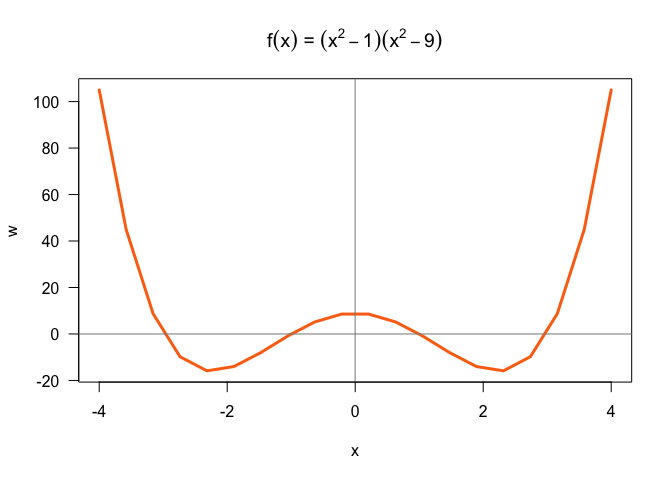

Lab 7: Simple Functions and Conditionals
================
Amy Kim

# Introduction

In this lab you will practice writing simple functions, and some basic
examples to make sure that the functions work as expected. Later in the
course we will see how to write assertions (i.e. tests) for your
functions in a more formal way.

In addition to writing the functions, you should also practice
documenting your functions. Writing this type of documentation should
become second nature. To do this, include roxygen comments such as:

  - \#’ @title Name of your function
  - \#’ @description What the function does
  - \#’ @param x input(s) of your function
  - \#’ @return output of your function

## Before you start …

By setting the global option error = TRUE you avoid the knitting process
to be stopped in case a code chunk generates an error.

Since you willl be writing a couple of functions with stop() statements,
it is essential that you set up error = TRUE, otherwise “knitr” will
stop knitting your Rmd file if it encounters an error.

## Toy Example

Here’s an example of how to write a function with its documentation:

``` r
#' @title area of rectangle
#' @description calculates the area of a rectangle
#' @param len length of the rectangle (numeric)
#' @param wid width of the rectangle (numeric)
#' @return computed area
rect_area <- function(len = 1, wid = 1) {
  if (len < 0) {
    stop("len must be positive")
  }
  if (wid < 0) {
    stop("wid must be positive")
  }
  area <- len * wid
  return(area)
}
```

Some tests:

``` r
# default
rect_area()
```

    ## [1] 1

``` r
# len=2, wid=3
rect_area(len = 2, wid = 3)
```

    ## [1] 6

``` r
# bad len
rect_area(len = -2, wid = 3) 
```

    ## Error in rect_area(len = -2, wid = 3): len must be positive

# Simple Math Functions

Consider the following mathematical functions:

  - f(x)=x^2
  - g(x)=2x+5

Write two functions f() and g() based on the previous equations. Don’t
forget to include roxygen comments to document your function\!

``` r
# your function f()
#' @title f(x)
#' @description calculates the x squared
#' @param x (numeric)
#' @return computed function

f <- function(x){
  x^2
}

# your function g()
#' @title g(x)
#' @description calculates 2 times x plus 5
#' @param x (numeric)
#' @return computed function

g <- function (x){
  2*x + 5
}
```

Test your functions with:

``` r
f(2)     # 4
```

    ## [1] 4

``` r
f(-5)    # 25
```

    ## [1] 25

``` r
g(0)     # 5
```

    ## [1] 5

``` r
g(-5/2)  # 0
```

    ## [1] 0

Use your functions f() and g() to create the following composite
functions:

  - fog() for the composite function: f∘g(x)
  - gof() for the composite function: g∘f(x)

<!-- end list -->

``` r
# your function fog()
#' @title fog()
#' @description composite function f o g(x)
#' @param x (numeric)
#' @return composite function

fog <- function (x){
  f(g(x))
}

# your function gof()
#' @title gof()
#' @description composite function g o f(x)
#' @param x (numeric)
#' @return composite function

gof <- function (x){
  g(f(x))
}
```

Test your composite functions with:

``` r
fog(2)     # 81
```

    ## [1] 81

``` r
fog(-5)    # 25
```

    ## [1] 25

``` r
gof(0)     # 5
```

    ## [1] 5

``` r
gof(-5/2)  # 17.5
```

    ## [1] 17.5

# Pythagoras

The pythagoras formula is used to compute the length of the hypotenuse,
c, of a right triangle with legs of length a and b.

Write a function pythagoras() that takes two arguments a and b, and
returns the length of the hypotenuse. Don’t forget to include roxygen
comments to document your function\!

``` r
# your pythagoras() function
#' @title pythagoras function
#' @description formula used to compute the length of the hypotenuse, c, of a right triangle with legs of length a and b.
#' @param a leg (numeric)
#' @param b leg (numeric)
#' @return c (hypotenuse)

pythagoras <- function(a,b){
  sqrt(a^2 + b^2)
}
```

Test your pythagoras() with two leg values: pythagoras(3, 4)

``` r
# test pythagoras(3, 4)
pythagoras(3,4)
```

    ## [1] 5

Modify your function pythagoras() so that argument b takes the same
value of argument a. Test it with just one leg value: pythagoras(5)

``` r
# test pythagoras(5)
#' @title pythagoras function
#' @description formula used to compute the length of the hypotenuse, c, of a right triangle with legs of same length a.
#' @param a leg (numeric)
#' @return c (hypotenuse)

pythagoras <- function(a){
  sqrt(a^2 + a^2)
}

pythagoras(5)
```

    ## [1] 7.071068

# Area of a circle

Consider a circle with radius = 2. The area of this circle can be
computed in R as:

``` r
# area of circle with radius 2
r <- 2
area <- pi * r^2
area
```

    ## [1] 12.56637

Write a function circle\_area() that calculates the area of a circle.
This function must take one argument radius. Give radius a default value
of 1. Don’t forget to include roxygen comments to document your
function\!

``` r
#' @title area of cirlce function
#' @description formula used to compute area of circle from radius r. 
#' @param radius radius (numeric)
#' @return area of circle 

circle_area <- function(radius = 1){
  pi * radius^2
}
```

For example:

``` r
# default (radius 1)
circle_area()
```

    ## [1] 3.141593

``` r
# radius 3
circle_area(radius = 3)
```

    ## [1] 28.27433

Modify your circle\_area() function in order to include a stop()
statement. If radius is negative, then the function should stop with a
message like: “radius cannot be negative”.

``` r
circle_area <- function(radius = 1){
  if(radius < 0){
    stop("radius cannot be negative")
  }
  pi * radius^2
}
```

Test your modified circle\_area() with radius = -2; the function should
return a stop message:

``` r
# bad radius
circle_area(radius = -2)
```

    ## Error in circle_area(radius = -2): radius cannot be negative

# Area of a cylinder

For a given cylinder of radius r and height h the area A is:

A = 2(pi)rh + 2(pi)r^2

For example. Say you have a cylinder with radius = 2, and height = 3.

``` r
# cylinder variables
r = 2  # radius
h = 3  # height

# area of cylinder
2 * pi * r * h + 2 * pi * r^2
```

    ## [1] 62.83185

Notice that the formula of the area of a cylinder includes the area of a
circle: π\*\*r2. Write a function cylinder\_area(), that calls
circle\_area(), to compute the area of a cylinder.

``` r
#' @title area of cylinder
#' @description formula used to compute area of cylinder from radius r and height h. 
#' @param radius  (numeric)
#' @param height  (numeric)
#' @return area of cylinder 

cylinder_area <- function(radius =1 , height =1){
    2*pi*radius*height + circle_area()
}
```

This function must take two arguments: radius and height. Give both
arguments a default value of 1. In addition, the function should stop if
any of radius or height are negative.

``` r
#' @title area of cylinder
#' @description formula used to compute area of cylinder from radius r and height h. 
#' @param radius  (numeric)
#' @param height  (numeric)
#' @return area of cylinder 
cylinder_area <- function(radius =1 , height =1){
  if(radius < 0){
    stop("radius cannot be negative")
  }
  if(height < 0){
    stop("height cannot be negative")
  }
    2*pi*radius*height + circle_area()
}
```

For instance:

``` r
# default (radius 1, height 1)
cylinder_area()
```

    ## [1] 9.424778

``` r
# radius 2, height 3
cylinder_area(radius = 2, height = 3)
```

    ## [1] 40.8407

These should return an error message:

``` r
# bad radius
cylinder_area(radius = -2, height = 1)
```

    ## Error in cylinder_area(radius = -2, height = 1): radius cannot be negative

``` r
# bad height
cylinder_area(radius = 2, height = -1)
```

    ## Error in cylinder_area(radius = 2, height = -1): height cannot be negative

``` r
# bad radius and height
cylinder_area(radius = -2, height = -1)
```

    ## Error in cylinder_area(radius = -2, height = -1): radius cannot be negative

# Volume of a cylinder

For a given cylinder of radius r and height h the volume V is:

V = h r^2\* pi

Write a function cylinder\_volume(), that calls circle\_area(), to
compute the volume of a cylinder. This function must take two arguments:
radius and height. Give both arguments a default value of 1.

``` r
#' @title volume of cylinder
#' @description formula used to compute volume of cylinder from radius r and height h. 
#' @param radius  (numeric)
#' @param height  (numeric)
#' @return volume of cylinder 

cylinder_volume <- function(radius = 1, height =1){
  circle_area(radius)*height
}
```

For example:

``` r
# default (radius 1, height 1)
cylinder_volume()
```

    ## [1] 3.141593

``` r
cylinder_volume(radius = 3, height = 10)
```

    ## [1] 282.7433

``` r
cylinder_volume(height = 10, radius = 3)
```

    ## [1] 282.7433

# Unit Conversion Formulas

The following exercises involve writing simple functions to convert from
one type of unit to other.

## Miles to Kilometers

Write a function miles2kms() that converts miles into kilometers: 1 mile
is equal to 1.6 kilometers. Give the argument a default value of 1.

``` r
#' @title miles to kilometers
#' @description formula used to coverts miles to kilometers 
#' @param miles (numeric)
#' @return kilometers 

miles2kms <- function(miles = 1) {
  miles*1.6
}
```

Use miles2kms() to obtain mile conversions, in order to create a table
(i.e. data frame) like the one below. The first ten rows range from 1 to
10 miles, and then from 10 to 100 in 10 mile steps. The second column
corresponds to kms.

| miles | kms |
| ----- | --- |
| 1     | 1.6 |
| 2     | 3.2 |
| …     | ….  |
| 10    | 16  |
| 20    | 32  |
| …     | …   |
| 100   | 160 |

``` r
milestokms <- as.data.frame(cbind(miles = c(1:100), kms = miles2kms(1:100)))
```

# Gallons to Liters, and viceversa

Write a function gallon2liters() that converts gallons to liters: 1
gallon is equal to 3.78541 liters:

``` r
# your gallons2liters() function
#' @title gallons to liters
#' @description formula used to coverts gallons to liters 
#' @param gallons (numeric)
#' @return liters 

gallons2liters <- function(gallons = 1) {
  gallons * 3.78541
}
```

Use gallon2liters() to make an inverse function liters2gallons().

``` r
# your liters2gallons() function
#' @title liters to gallons
#' @description formula used to coverts liters to gallons 
#' @param liters (numeric)
#' @return gallons 

liters2gallons <- function(liters){
  liters/3.78541
}
```

Use liters2gallons() to obtain liter conversions, in order to create a
table (i.e. data frame) like the one below. The first ten rows range
from 1 to 10 liters, and then from 10 to 100 in 10 liter steps. The
second column corresponds to gallons.

| liters | gallons   |
| ------ | --------- |
| 1      | 0.2641722 |
| 2      | 0.5283444 |
| …      | …         |
| 10     | 2.6417218 |
| 20     | 5.283444  |
| …      | …         |
| 100    | 26.417218 |

``` r
literstogallons <- as.data.frame(
  cbind(liters = 
        c(1:9, seq(10,100, by = 10)), 
      gallons = liters2gallons(c(1:9, seq(10,100, by = 10))))
      )
```

## Seconds to Years

According to Wikipedia, in 2015 the life expectancy of a person born in
the US was 79 years. Consider the following question: Can a newborn baby
in USA expect to live for one billion (10^9) seconds?

To answer this question, write a function seconds2years() that takes a
number in seconds and returns the equivalent number of years. Test the
function with seconds2years(1000000000)

``` r
seconds2years <- function(seconds){
  seconds/(60*60*24*365)
}

seconds2years(1000000000)
```

    ## [1] 31.70979

# Gaussian Function

The Gaussian (Normal) function, given in the equation below, is one of
the most widely used functions in science and statistics

The parameters σ and μ are real numbers, where σ must be greater than
zero.

Make a function gaussian() that takes three arguments: x, m, and s.
Evaluate the function with m=0, s=2, and x=1.

``` r
gaussian <- function(x, m, s){
  1/(s * sqrt(2*pi)) * exp((-0.5)*((x-m)/s)^2)
}

gaussian(1,0,2)
```

    ## [1] 0.1760327

Test your gaussian() function and compare it with the R function dnorm()

``` r
# compare with dnorm()
dnorm(x = 1, mean = 0, sd = 2)
```

    ## [1] 0.1760327

Now try gaussian() with a vector seq(-4.5, 4.5, by = 0.1), and pass the
values to plot() to get a normal curve. Here’s code with values obtained
from dnorm()

``` r
# you should get a plot like this one
x_values <- seq(from = -4.5, to = 4.5, by = 0.1)
y_values <- dnorm(x_values, mean = 0, sd = 2)
plot(x_values, y_values, las = 1, type = "l", lwd = 2)
```

<!-- -->

## Your turn:

``` r
# you should get a plot like this one
x_values <- seq(from = -4.5, to = 4.5, by = 0.1)
y_values <- gaussian(x = x_values, m = 0, s = 2)
plot(x_values, y_values, las = 1, type = "l", lwd = 2)
```

<!-- -->

# Polynomials

In this problem we want to see whether the graph of a given polynomial
will cross or touch the x axis in a given interval.

Let’s begin with the polynomial: f(x)=x^2(x−1). The first thing to do is
write a function for the polynomial, for instance:

``` r
poly1 <- function(x) {
  (x^2) * (x - 1)
}
```

Once you have a function for the polynomial, you can create a set of
pairs of points x and y=f(x), and then use them to graph the polynomial

``` r
# set of points
x <- seq(-4, 4, length.out = 20)
y <- poly1(x)

# graph polynomial
plot(x, y, type = 'l', lwd = 3, col = "#FB7215", las = 1)
abline(h = 0, v = 0, col = '#888888aa', lwd = 1.5)
title(main = expression(paste(f(x), ' = ', x^2, (x - 1))))
```

<!-- -->

Write functions and graph the following polynomials in the x-axis
interval -4 to 4:

1)  f(x)=x^3
2)  f(x)=(x<sup>2−1)(x+3)</sup>3
3)  f(x)=(x<sup>2−1)(x</sup>2−9)

<!-- end list -->

``` r
poly1 <- function(x) {
  (x^3)
}

poly2 <- function(x) {
  (x^2 - 1)* (x + 3)^3
}

poly3 <- function(x){
  (x^2 - 1)*(x^2 - 9)
}

# sequential
x <- seq(-4, 4, length.out = 20)
y <- poly1(x)
z <- poly2(x)
w <- poly3(x)

#plot 1
plot(x, y, type = 'l', lwd = 3, col = "#FB7215", las = 1)
abline(h = 0, v = 0, col = '#888888aa', lwd = 1.5)
title(main = expression(paste(f(x), ' = ', x^3)))
```

<!-- -->

``` r
#plot 2
plot(x, z, type = 'l', lwd = 3, col = "#FB7215", las = 1)
abline(h = 0, v = 0, col = '#888888aa', lwd = 1.5)
title(main = expression(paste(f(x), ' = ', (x^2 - 1) * (x + 3)^3)))
```

<!-- -->

``` r
#plot 3
plot(x, w, type = 'l', lwd = 3, col = "#FB7215", las = 1)
abline(h = 0, v = 0, col = '#888888aa', lwd = 1.5)
title(main = expression(paste(f(x), ' = ', (x^2 - 1)*(x^2 - 9))))
```

<!-- -->

# Descriptive Statistics

Write a function descriptive() that takes a numeric vector as input, and
returns a named vector with the following descriptive statistics:

  - min: minimum
  - q1: first quartile (Q2)
  - median: median
  - mean: mean
  - q3: third quartile (Q3)
  - max: maximum
  - range: range or span (max - min)
  - iqr: interquartile range (IQR)
  - sd: standard deviation

<!-- end list -->

``` r
# your descriptive() function
descriptive <- function(x) {
  list(summary(x), range = max(x) - min(x), iqr = IQR(x), sd = sd(x))
}

x <- c(1:100)
descriptive(x)
```

    ## [[1]]
    ##    Min. 1st Qu.  Median    Mean 3rd Qu.    Max. 
    ##    1.00   25.75   50.50   50.50   75.25  100.00 
    ## 
    ## $range
    ## [1] 99
    ## 
    ## $iqr
    ## [1] 49.5
    ## 
    ## $sd
    ## [1] 29.01149

# If Conditionals

Write R code that will “squish” a number into the interval \[0, 100\],
so that a number less than 0 is replaced by 0 and a number greater than
100 is replaced by 100.

``` r
z <- 100*pi
# Fill in the following if-else statements. You may (or may not) 
# have to add or subtract else if or else statements.
if (z < 0) { # Replace TRUE with a condition.
  print(0)
} else if (z > 100) { # Replace TRUE with a condition.
  print(100)
}
```

    ## [1] 100

## Multiple If’s

A common situation involves working with multiple conditions at the same
time. You can chain multiple if-else statements:

``` r
y <- 3 # Change this value!

if (y > 0) {
  print("positive")
} else if (y < 0) {
  print("negative")
} else {
  print("zero?")
}
```

    ## [1] "positive"

# Even number

Write a function is\_even() that determines whether a number is even
(i.e. multiple of 2). If the input number is even, the output should be
TRUE. If the input number is odd, the output should be FALSE. If the
input is not a number, the output should be NA

``` r
is_even <-function(x){
  if(!is.numeric(x)){
    print("NA")
  }
  else if (x %% 2  == 0){
    print("TRUE")
  }
  else if (x %% 2 != 0){
    print("FALSE")
  }
}
```

Test your function:

``` r
# even number
is_even(10)
```

    ## [1] "TRUE"

``` r
# odd number
is_even(33)
```

    ## [1] "FALSE"

``` r
# not a number
is_even('a')
```

    ## [1] "NA"

# Odd number

Use your function is\_even() to write a function is\_odd() that
determines if a number is odd (i.e. not a multiple of 2). If a number is
odd, the output should be TRUE; if a number is even the output should be
FALSE; if the input is not a number the output should be NA

``` r
is_odd <-function(x){
  if(!is.numeric(x)){
    print("NA")
  }
  else if (x %% 2  != 0){
    print("TRUE")
  }
  else if (x %% 2 == 0){
    print("FALSE")
  }
}
```

Test is\_odd() with the following cases:

``` r
# odd number
is_odd(1)
```

    ## [1] "TRUE"

``` r
# even number
is_odd(4)
```

    ## [1] "FALSE"

``` r
# not a number
is_odd('a')
```

    ## [1] "NA"

# Switch

Working with multiple chained if’s becomes cumbersome. Consider the
following example that uses several if’s to convert a day of the week
into a number:

``` r
# Convert the day of the week into a number.
day <- "Tuesday" # Change this value!

if (day == 'Sunday') {
  num_day <- 1
} else {
  if (day == "Monday") {
    num_day <- 2
  } else {
    if (day == "Tuesday") {
      num_day <- 3
    } else {
      if (day == "Wednesday") {
        num_day <- 4
      } else {
        if (day == "Thursday") {
          num_day <- 5
        } else {
          if (day == "Friday") {
            num_day <- 6
          } else {
            if (day == "Saturday") {
              num_day <- 7
            }
          }
        }
      }
    }
  }
}


num_day
```

    ## [1] 3

Working with several nested if’s like in the example above can be a
nigthmare.

In R, you can get rid of many of the braces like this:

``` r
# Convert the day of the week into a number.
day <- "Tuesday" # Change this value!

if (day == 'Sunday') {
  num_day <- 1
} else if (day == "Monday") {
  num_day <- 2
} else if (day == "Tuesday") {
  num_day <- 3
} else if (day == "Wednesday") {
  num_day <- 4
} else if (day == "Thursday") {
  num_day <- 5
} else if (day == "Friday") {
  num_day <- 6
} else if (day == "Saturday") {
  num_day <- 7
}

num_day
```

    ## [1] 3

## Your turn: a grading function

Write a function grade() that takes a score argument (i.e. a numeric
value between 0 and 100), and returns a letter grade (i.e. character)
based on the following grading scheme:

``` r
grade <- function(score){
  if(score < 60){
    print("F")
  } else if(score > 60 & score < 70 | score == 60){
    print("D")
  } else if(score > 70 & score < 80 | score == 70){
    print("C")
  } else if(score > 80 & score < 90 | score == 80){
    print("B")
  } else if(score > 90 & score < 100 | score == 100 | score == 90){
    print("A")}
}
```

You should be able to call your grade() function like this:

``` r
# grade "A"
grade(score = 90)
```

    ## [1] "A"

``` r
# grade "B"
grade(score = 89.9999)
```

    ## [1] "B"

``` r
# grade "C"
grade(score = 70.0000001)
```

    ## [1] "C"

``` r
# grade "F"
grade(score = 50)
```

    ## [1] "F"

Modify your grade() function to include a stop() condition when the
input score value is less than zero or greater than 100. The error
message should say something like:

``` r
#"score must be a number between 0 and 100"

#modify function
grade <- function(score){
  if(score < 60 & score > 0){
    print("F")
  } else if(score > 60 & score < 70 | score == 60){
    print("D")
  } else if(score > 70 & score < 80 | score == 70){
    print("C")
  } else if(score > 80 & score < 90 | score == 80){
    print("B")
  } else if(score > 90 & score < 100 | score == 100 | score == 90){
    print("A")
  } else if(score < 0){
    print("score must be a number between 0 and 100")
  } else if(score > 100){
    print("score must be a number between 0 and 100")
  }
}

grade(-100)
```

    ## [1] "score must be a number between 0 and 100"

# The switch() function

Consider again the chain of if-then-else’s used to convert a name day
into a number dat. We have too many if’s, and there’s a lot of
repetition in the code. If you find yourself using many if-else
statements with identical structure for slightly different cases, you
may want to consider a switch statement instead:

``` r
# Convert the day of the week into a number.
day <- "Tuesday" # Change this value!

switch(day, # The expression to be evaluated.
  Sunday = 1,
  Monday = 2,
  Tuesday = 3,
  Wednesday = 4,
  Thursday = 5,
  Friday = 6,
  Saturday = 7,
  NA) # an (optional) default value if there are no matches
```

    ## [1] 3

Switch statements can also accept integer arguments, which will act as
indices to choose a corresponding element:

``` r
# Convert a number into a day of the week.
day_num <- 3 # Change this value!

switch(day_num,
  "Sunday",
  "Monday",
  "Tuesday",
  "Wednesday",
  "Thursday",
  "Friday",
  "Saturday")
```

    ## [1] "Tuesday"

# Converting Miles to other units

The table below shows the different formulas for converting miles (mi)
into other scales:

| Units  | Formula         |
| ------ | --------------- |
| Inches | mi x 63360      |
| Feet   | mi x 5280       |
| Yards  | mi x 1760       |
| Meters | mi / 0.00062137 |
| Kms    | mi / 0.62137    |

Write the following five functions for each type of conversion. Each
function must take one argument x with default value: x = 1.

  - miles2inches()
  - miles2feet()
  - miles2yards()
  - miles2meters()
  - miles2kms()

<!-- end list -->

``` r
#miles2inches()
miles2inches <- function(x = 1){
  x * 63360
}

# miles2feet()
miles2feet <- function(x = 1){
  x * 5280
}

# miles2yards()
miles2yards <- function(x = 1){
  x * 1760
}

# miles2meters()
miles2meters <- function (x = 1){
  x / 0.00062137
}

# miles2kms()
miles2kms <- function(x = 1){
  x / 0.62137
}
```

For example:

``` r
miles2inches(2)
```

    ## [1] 126720

``` r
miles2feet(2)
```

    ## [1] 10560

``` r
miles2yards(2)
```

    ## [1] 3520

``` r
miles2meters(2)
```

    ## [1] 3218.694

``` r
miles2kms(2)
```

    ## [1] 3.218694

# Using switch()

Create a function convert() that converts miles into the specified
units. Use switch() and the previously defined functions—miles2inches(),
miles2feet(), …, miles2kms—to define convert(). Use two arguments: x and
to, like this:

``` r
convert <- function(x, to = "km"){
  switch(to,
       inches = miles2inches(x),
       ft = miles2feet(x),
       yd = miles2yards(x),
       m = miles2meters(x),
       kms = miles2kms(x))
  }

convert(40, to = "inches")
```

    ## [1] 2534400

By default, to = “km”, but it can take values such as “in”, “ft”, “yd”,
or “m”.

Test convert() with:

``` r
convert(3, "inches")
```

    ## [1] 190080

``` r
convert(3, "ft")
```

    ## [1] 15840

``` r
convert(3, "yd")
```

    ## [1] 5280

``` r
convert(3, "m")
```

    ## [1] 4828.041

``` r
convert(3, "kms")
```

    ## [1] 4.828041
