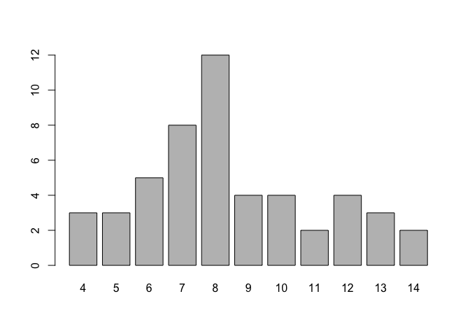

Lab 9: Testing functions, and string basics
================

# R package “testthat”

“testthat” is one of the packages in R that helps you write tests for
your functions. First, remember to install the package:

  - “testthat” provides a testing framework for R that is easy to learn
    and use
  - “testthat” has a hierarchical structure made up of:
  - expectations
  - tests
  - contexts
  - A context involves tests formed by groups of expectations
  - Each structure has associated functions:
  - expect\_that() for expectations
  - test\_that() for groups of tests
  - context() for contexts

<!-- end list -->

``` r
library(testthat)
```

## List of common expectation functions

| Function                 | Description                               |
| ------------------------ | ----------------------------------------- |
| expect\_true(x)          | expects that x is TRUE                    |
| expect\_false(x)         | expects that x is FALSE                   |
| expect\_null(x)          | expects that x is NULL                    |
| expect\_type(x)          | expects that x is of type y               |
| expect\_is(x, y)         | expects that x is of class y              |
| expect\_length(x, y)     | expects that x is of length y             |
| expect\_equal(x, y)      | expects that x is equal to y              |
| expect\_equivalent(x, y) | expects that x is equivalent to y         |
| expect\_identical(x, y)  | expects that x is identical to y          |
| expect\_lt(x, y)         | expects that x is less than y             |
| expect\_gt(x, y)         | expects that x is greater than y          |
| expect\_lte(x, y)        | expects that x is less than or equal to y |
| expect\_gte(x, y)        | expects that x is greater than or equal y |
| expect\_named(x)         | expects that x has names y                |
| expect\_matches(x, y)    | expects that x matches y (regex)          |
| expect\_message(x, y)    | expects that x gives message y            |
| expect\_warning(x, y)    | expects that x gives warning y            |
| expect\_error(x, y)      | expects that x throws error y             |

## Practice writing simple tests

  - To start the practice, create a new directory, e.g. lab09
  - cd to lab09
  - Create an R script to write and document your functions:
    e.g. functions.R
  - Create a separate R script tests.R to write the tests of your
    functions.

## Example with stat\_range()

Let’s start with a basic function stat\_range() to compute the overall
range of a numeric vector. Create this function in the file functions.R.

``` r
stat_range <- function(x) {
  max(x) - min(x)
}
```

  - description: computes the range of a numeric vector (i.e. max - min)
  - input: a numeric vector
  - output: the range value (max - min)

## Tests for stat\_range()

To write the unit tests in tests.R, we are going to consider the
following testing vectors:

  - x \<- c(1, 2, 3, 4, 5)
  - y \<- c(1, 2, 3, 4, NA)
  - z \<- c(TRUE, FALSE, TRUE)
  - w \<- letters\[1:5\]

The typical structure of the tests has the following form:

``` r
# load the source code of the functions to be tested
source("functions.R")

# context with one test that groups expectations
context("Test for range value") 

test_that("range works as expected", {
  x <- c(1, 2, 3, 4, 5)
  
  expect_equal(stat_range(x), 4)
  expect_length(stat_range(x), 1)
  expect_type(stat_range(x), 'double')
})
```

    ## Test passed 🥇

  - use context() to describe what the test are about
  - use test\_that() to group expectations:
  - output equal to 4
  - output of length one
  - output of type double
  - to run the tests from the R console, use the function test\_file()
    by passing the path of the file tests.R

<!-- end list -->

``` r
# assuming that your working directory is "lab09/"
library(testthat)
test_file("tests.R")
```

    ## 
    ## ══ Testing tests.R ═════════════════════════════════════════════════════════════
    ## [ FAIL 0 | WARN 0 | SKIP 0 | PASS 0 ][ FAIL 0 | WARN 0 | SKIP 0 | PASS 0 ][ FAIL 0 | WARN 0 | SKIP 0 | PASS 1 ][ FAIL 0 | WARN 0 | SKIP 0 | PASS 2 ][ FAIL 0 | WARN 0 | SKIP 0 | PASS 3 ][ FAIL 1 | WARN 0 | SKIP 0 | PASS 3 ][ FAIL 2 | WARN 0 | SKIP 0 | PASS 3 ][ FAIL 2 | WARN 0 | SKIP 0 | PASS 4 ]
    ## 
    ## ── Error (tests.R:19:3): range value for numeric vectors with NAs ──────────────
    ## Error in `range_value(y)`: could not find function "range_value"
    ## Backtrace:
    ##  1. testthat::expect_equal(range_value(y), NA_real_) tests.R:19:2
    ##  2. testthat::quasi_label(enquo(object), label, arg = "object")
    ##  3. rlang::eval_bare(expr, quo_get_env(quo))
    ## 
    ## ── Error (tests.R:26:3): range value for logical vectors ───────────────────────
    ## Error in `range_value(z)`: could not find function "range_value"
    ## Backtrace:
    ##  1. testthat::expect_equal(range_value(z), 1L) tests.R:26:2
    ##  2. testthat::quasi_label(enquo(object), label, arg = "object")
    ##  3. rlang::eval_bare(expr, quo_get_env(quo))
    ## 
    ## [ FAIL 2 | WARN 0 | SKIP 0 | PASS 4 ]

You could actually include a code chunk in your Rmd with the code above.

## Your Turn

Write more groups of tests—test\_that()—to test stat\_range() with the
rest of the testing vectors y, z, w:

  - Using y, write expectations for:
  - output is of length one
  - output is equal to NA\_real\_
  - Using z, write expectations for:
  - output is of length one
  - output is of type integer
  - output is equal to 1L
  - Using w, write expectations for:
  - throws an error

<!-- end list -->

``` r
test_that("range value for numeric vectors with NAs", {
  y <- c(1, 2, 3, 4, NA)
  
  expect_equal(stat_range(y), NA_real_)
  expect_length(stat_range(y), 1)
})
```

    ## Test passed 🥳

``` r
test_that("range value for logical vectors", {
  z <- c(TRUE, FALSE, TRUE)
  
  expect_equal(stat_range(z), 1L)
  expect_length(stat_range(z), 1)
  expect_type(stat_range(z), 'integer')
})
```

    ## Test passed 😀

``` r
test_that("range value stops for character vectors", {
  w <- letters[1:5]
  
  expect_error(range_value(w))
})
```

    ## Test passed 🎉

Try writing the following functions and come up with unit tests:

  - stat\_centers()
  - description: computes measures of center such as Median and Mean
  - input: a numeric vector
  - output: a numeric vector with median and mean
  - use mean() and median() to write stat\_centers()
  - stat\_spreads()
  - description: computes measures of spread such as Range, IQR,
    Standard Deviation
  - input: a numeric vector
  - output: a numeric vector with range, iqr, and stdev
  - use stat\_range(), IQR(), and sd() to write stat\_spreads()

<!-- end list -->

``` r
#' @title Center measures
#' @description Computes measures of center: mean and median
#' @param x numeric vector
#' @return vector with mean and median
stat_centers <- function(x) {
  c('mean' = mean(x), 'median' = median(x))
}


#' @title Spread measures
#' @description Computes measures of spread: range, IQR, and SD
#' @param x numeric vector
#' @return vector with range, iqr, and stdev
stat_spreads <- function(x) {
  c('range' = stat_range(x), 
    'iqr' = IQR(x),
    'stdev' = sd(x))
}
```

# Basics of String Manipulation

In this second part of the lab, you will be using the row names of the
data frame USArrests (this data comes already in R):

``` r
head(USArrests)
```

    ##            Murder Assault UrbanPop Rape
    ## Alabama      13.2     236       58 21.2
    ## Alaska       10.0     263       48 44.5
    ## Arizona       8.1     294       80 31.0
    ## Arkansas      8.8     190       50 19.5
    ## California    9.0     276       91 40.6
    ## Colorado      7.9     204       78 38.7

``` r
states <- rownames(USArrests)
head(states)
```

    ## [1] "Alabama"    "Alaska"     "Arizona"    "Arkansas"   "California"
    ## [6] "Colorado"

Here are some functions that you may need to use in this lab:

  - nchar()
  - tolower()
  - toupper()
  - casefold()
  - paste()
  - paste0()
  - substr()

## Number of characters

nchar() allows you to count the number of characters in a string. Use it
on states to get the number of characters of each state:

``` r
# number of characters
nchar(states)
```

    ##  [1]  7  6  7  8 10  8 11  8  7  7  6  5  8  7  4  6  8  9  5  8 13  8  9 11  8
    ## [26]  7  8  6 13 10 10  8 14 12  4  8  6 12 12 14 12  9  5  4  7  8 10 13  9  7

## Case folding

There are 3 functions to do case-folding: tolower(), toupper(), and
casefold(). Apply each function on states to see what happens:

``` r
# to lower case
tolower(states)
```

    ##  [1] "alabama"        "alaska"         "arizona"        "arkansas"      
    ##  [5] "california"     "colorado"       "connecticut"    "delaware"      
    ##  [9] "florida"        "georgia"        "hawaii"         "idaho"         
    ## [13] "illinois"       "indiana"        "iowa"           "kansas"        
    ## [17] "kentucky"       "louisiana"      "maine"          "maryland"      
    ## [21] "massachusetts"  "michigan"       "minnesota"      "mississippi"   
    ## [25] "missouri"       "montana"        "nebraska"       "nevada"        
    ## [29] "new hampshire"  "new jersey"     "new mexico"     "new york"      
    ## [33] "north carolina" "north dakota"   "ohio"           "oklahoma"      
    ## [37] "oregon"         "pennsylvania"   "rhode island"   "south carolina"
    ## [41] "south dakota"   "tennessee"      "texas"          "utah"          
    ## [45] "vermont"        "virginia"       "washington"     "west virginia" 
    ## [49] "wisconsin"      "wyoming"

``` r
# to upper case
toupper(states)
```

    ##  [1] "ALABAMA"        "ALASKA"         "ARIZONA"        "ARKANSAS"      
    ##  [5] "CALIFORNIA"     "COLORADO"       "CONNECTICUT"    "DELAWARE"      
    ##  [9] "FLORIDA"        "GEORGIA"        "HAWAII"         "IDAHO"         
    ## [13] "ILLINOIS"       "INDIANA"        "IOWA"           "KANSAS"        
    ## [17] "KENTUCKY"       "LOUISIANA"      "MAINE"          "MARYLAND"      
    ## [21] "MASSACHUSETTS"  "MICHIGAN"       "MINNESOTA"      "MISSISSIPPI"   
    ## [25] "MISSOURI"       "MONTANA"        "NEBRASKA"       "NEVADA"        
    ## [29] "NEW HAMPSHIRE"  "NEW JERSEY"     "NEW MEXICO"     "NEW YORK"      
    ## [33] "NORTH CAROLINA" "NORTH DAKOTA"   "OHIO"           "OKLAHOMA"      
    ## [37] "OREGON"         "PENNSYLVANIA"   "RHODE ISLAND"   "SOUTH CAROLINA"
    ## [41] "SOUTH DAKOTA"   "TENNESSEE"      "TEXAS"          "UTAH"          
    ## [45] "VERMONT"        "VIRGINIA"       "WASHINGTON"     "WEST VIRGINIA" 
    ## [49] "WISCONSIN"      "WYOMING"

``` r
# case folding (upper = TRUE)
casefold(states, upper = TRUE)
```

    ##  [1] "ALABAMA"        "ALASKA"         "ARIZONA"        "ARKANSAS"      
    ##  [5] "CALIFORNIA"     "COLORADO"       "CONNECTICUT"    "DELAWARE"      
    ##  [9] "FLORIDA"        "GEORGIA"        "HAWAII"         "IDAHO"         
    ## [13] "ILLINOIS"       "INDIANA"        "IOWA"           "KANSAS"        
    ## [17] "KENTUCKY"       "LOUISIANA"      "MAINE"          "MARYLAND"      
    ## [21] "MASSACHUSETTS"  "MICHIGAN"       "MINNESOTA"      "MISSISSIPPI"   
    ## [25] "MISSOURI"       "MONTANA"        "NEBRASKA"       "NEVADA"        
    ## [29] "NEW HAMPSHIRE"  "NEW JERSEY"     "NEW MEXICO"     "NEW YORK"      
    ## [33] "NORTH CAROLINA" "NORTH DAKOTA"   "OHIO"           "OKLAHOMA"      
    ## [37] "OREGON"         "PENNSYLVANIA"   "RHODE ISLAND"   "SOUTH CAROLINA"
    ## [41] "SOUTH DAKOTA"   "TENNESSEE"      "TEXAS"          "UTAH"          
    ## [45] "VERMONT"        "VIRGINIA"       "WASHINGTON"     "WEST VIRGINIA" 
    ## [49] "WISCONSIN"      "WYOMING"

``` r
# case folding (upper = FALSE)
casefold(states, upper = FALSE)
```

    ##  [1] "alabama"        "alaska"         "arizona"        "arkansas"      
    ##  [5] "california"     "colorado"       "connecticut"    "delaware"      
    ##  [9] "florida"        "georgia"        "hawaii"         "idaho"         
    ## [13] "illinois"       "indiana"        "iowa"           "kansas"        
    ## [17] "kentucky"       "louisiana"      "maine"          "maryland"      
    ## [21] "massachusetts"  "michigan"       "minnesota"      "mississippi"   
    ## [25] "missouri"       "montana"        "nebraska"       "nevada"        
    ## [29] "new hampshire"  "new jersey"     "new mexico"     "new york"      
    ## [33] "north carolina" "north dakota"   "ohio"           "oklahoma"      
    ## [37] "oregon"         "pennsylvania"   "rhode island"   "south carolina"
    ## [41] "south dakota"   "tennessee"      "texas"          "utah"          
    ## [45] "vermont"        "virginia"       "washington"     "west virginia" 
    ## [49] "wisconsin"      "wyoming"

## Length of State Names

We just saw how to use nchar() to count the number of characters in each
state name:

``` r
# number of charcaters
num_chars <- nchar(states)
```

Use the vector num\_chars to obtain a frequency table called
char\_freqs, and then plot the frequencies with a bar chart:

``` r
# frequency table
char_freqs <- table(num_chars)

# barchart of number-of-characters
barplot(char_freqs)
```

<!-- -->

## Pasting strings

R provides the paste() function. This function allows you to paste
(i.e. append, concatenate) character vectors separated by a blank
space:

``` r
paste('Pumpkin', 'Pie')
```

    ## [1] "Pumpkin Pie"

You can give it any number of vector inputs

``` r
paste('a', 'b', 'c', 'd', 'e')
```

    ## [1] "a b c d e"

You can change the separator with sep

``` r
paste('a', 'b', 'c', 'd', 'e', sep = '-')
```

    ## [1] "a-b-c-d-e"

paste() is vectorized:

``` r
paste('a', 1:5, sep = '.')
```

    ## [1] "a.1" "a.2" "a.3" "a.4" "a.5"

There’s a special wrapper around paste() called paste0() which is
equivalent to paste(…, sep = "")

``` r
# paste0() -vs- paste(..., sep = "")
paste0('Pumpkin', 'Pie')
```

    ## [1] "PumpkinPie"

``` r
paste('Pumpkin', 'Pie', sep = '')
```

    ## [1] "PumpkinPie"

``` r
# paste0() is also vectorized
paste0('a', 1:5)
```

    ## [1] "a1" "a2" "a3" "a4" "a5"

**Your Turn** : Use paste() to form a new vector with the first five
states and their number of characters like this: “Alabama = 7” “Alaska =
6” “Arizona = 7” “Arkansas = 8” “California = 10”

``` r
# paste names with their num-of-chars
paste(states[1:5], num_chars[1:5], sep = ' = ')
```

    ## [1] "Alabama = 7"     "Alaska = 6"      "Arizona = 7"     "Arkansas = 8"   
    ## [5] "California = 10"

Now use paste()’s argument collapse = ’’ to collapse the first five
states like this: “AlabamaAlaskaArizonaArkansasCalifornia”

``` r
# collapse first 5 states
paste(states[1:5], collapse = '')
```

    ## [1] "AlabamaAlaskaArizonaArkansasCalifornia"

## Substrings

R provieds the function substr() to extract substrings in a character
vector:

``` r
# extract first 3 characters
substr('Berkeley', 1, 3)
```

    ## [1] "Ber"

Use substr() to shorten the state names using the first 3-letters:

``` r
# shorten state names with first 3 characters
substr(states, 1, 3)
```

    ##  [1] "Ala" "Ala" "Ari" "Ark" "Cal" "Col" "Con" "Del" "Flo" "Geo" "Haw" "Ida"
    ## [13] "Ill" "Ind" "Iow" "Kan" "Ken" "Lou" "Mai" "Mar" "Mas" "Mic" "Min" "Mis"
    ## [25] "Mis" "Mon" "Neb" "Nev" "New" "New" "New" "New" "Nor" "Nor" "Ohi" "Okl"
    ## [37] "Ore" "Pen" "Rho" "Sou" "Sou" "Ten" "Tex" "Uta" "Ver" "Vir" "Was" "Wes"
    ## [49] "Wis" "Wyo"

Use substr() to shorten the state names using the last 3-letters:

``` r
# shorten state names with last 3 characters
substr(states, num_chars - 2, num_chars)
```

    ##  [1] "ama" "ska" "ona" "sas" "nia" "ado" "cut" "are" "ida" "gia" "aii" "aho"
    ## [13] "ois" "ana" "owa" "sas" "cky" "ana" "ine" "and" "tts" "gan" "ota" "ppi"
    ## [25] "uri" "ana" "ska" "ada" "ire" "sey" "ico" "ork" "ina" "ota" "hio" "oma"
    ## [37] "gon" "nia" "and" "ina" "ota" "see" "xas" "tah" "ont" "nia" "ton" "nia"
    ## [49] "sin" "ing"

How would you shorten the state names using the first letter and the
last 3-letters? For instance: “Aama” “Aska” “Aona” “Asas” etc.

``` r
# shorten state names with first 3 characters
paste0(substr(states, 1, 1),
       substr(states, num_chars - 2, num_chars))
```

    ##  [1] "Aama" "Aska" "Aona" "Asas" "Cnia" "Cado" "Ccut" "Dare" "Fida" "Ggia"
    ## [11] "Haii" "Iaho" "Iois" "Iana" "Iowa" "Ksas" "Kcky" "Lana" "Mine" "Mand"
    ## [21] "Mtts" "Mgan" "Mota" "Mppi" "Muri" "Mana" "Nska" "Nada" "Nire" "Nsey"
    ## [31] "Nico" "Nork" "Nina" "Nota" "Ohio" "Ooma" "Ogon" "Pnia" "Rand" "Sina"
    ## [41] "Sota" "Tsee" "Txas" "Utah" "Vont" "Vnia" "Wton" "Wnia" "Wsin" "Wing"

## Challenge

We already obtained a frequency table char\_freqs with the counts of
state names by number of characters. You can use those frequencies to
get those state-names with 4-characters or 10-characters:

``` r
# 4-char states
states[num_chars == 4]
```

    ## [1] "Iowa" "Ohio" "Utah"

``` r
# 10-char states
states[num_chars == 10]
```

    ## [1] "California" "New Jersey" "New Mexico" "Washington"

You can use paste() to join the 4-character states in one single string
(i.e. collapsing) like this—separated by a comma and space—:

``` r
# collapse 4-char states
paste(states[num_chars == 4], collapse = ", ")
```

    ## [1] "Iowa, Ohio, Utah"

**Here’s one challenge for you**: write code (using a for-loop) to
obtain a list states\_list containing the collapsed names by number of
characters. If the number of characters is an even number, then the
state names should be in capital letters. Otherwise, they should be in
lower case letters.

Each list element of states\_list must be named with the number of
characters, followed by a dash, followed by the word chars: e.g.
‘4-chars’, ‘5-chars’, etc. In total, states\_list should have the same
length as char\_freqs.

Here’s what states\_list should look like for the first three elements:

``` r
#$`4-chars`
#[1] "IOWA, OHIO, UTAH"

#$`5-chars`
#[1] "idaho, maine, texas"

#$`6-chars`
#[1] "ALASKA, HAWAII, KANSAS, NEVADA, OREGON"
```

``` r
char_freqs <- table(num_chars)
char_classes <- as.numeric(names(char_freqs))
states_list <- vector("list", length(char_classes))

for (i in 1:length(char_freqs)) {
  collapsed <- paste0(states[num_chars == char_classes[i]], collapse = ", ")
  if (char_classes[i] %% 2 == 0) {
    states_list[[i]] <- toupper(collapsed)
  } else {
    states_list[[i]] <- tolower(collapsed)
  }
}

names(states_list) <- paste0(char_classes, "-chars")
states_list
```

    ## $`4-chars`
    ## [1] "IOWA, OHIO, UTAH"
    ## 
    ## $`5-chars`
    ## [1] "idaho, maine, texas"
    ## 
    ## $`6-chars`
    ## [1] "ALASKA, HAWAII, KANSAS, NEVADA, OREGON"
    ## 
    ## $`7-chars`
    ## [1] "alabama, arizona, florida, georgia, indiana, montana, vermont, wyoming"
    ## 
    ## $`8-chars`
    ## [1] "ARKANSAS, COLORADO, DELAWARE, ILLINOIS, KENTUCKY, MARYLAND, MICHIGAN, MISSOURI, NEBRASKA, NEW YORK, OKLAHOMA, VIRGINIA"
    ## 
    ## $`9-chars`
    ## [1] "louisiana, minnesota, tennessee, wisconsin"
    ## 
    ## $`10-chars`
    ## [1] "CALIFORNIA, NEW JERSEY, NEW MEXICO, WASHINGTON"
    ## 
    ## $`11-chars`
    ## [1] "connecticut, mississippi"
    ## 
    ## $`12-chars`
    ## [1] "NORTH DAKOTA, PENNSYLVANIA, RHODE ISLAND, SOUTH DAKOTA"
    ## 
    ## $`13-chars`
    ## [1] "massachusetts, new hampshire, west virginia"
    ## 
    ## $`14-chars`
    ## [1] "NORTH CAROLINA, SOUTH CAROLINA"

# Converting from Fahrenheit Degrees

Here are four functions that convert from Fahrenheit degrees to other
temperature scales:

``` r
to_celsius <- function(x = 1) {
  (x - 32) * (5/9)
}

to_kelvin <- function(x = 1) {
  (x + 459.67) * (5/9)
}

to_reaumur <- function(x = 1) {
  (x - 32) * (4/9)
}

to_rankine <- function(x = 1) {
  x + 459.67
}
```

We can use the previous functions to create a more general function
temp\_convert():

``` r
temp_convert <- function(x = 1, to = "celsius") {
  switch(to,
         "celsius" = to_celsius(x),
         "kelvin" = to_kelvin(x),
         "reaumur" = to_reaumur(x),
         "rankine" = to_rankine(x))
}

temp_convert(30, 'celsius')
```

    ## [1] -1.111111

temp\_convert() works fine when the argument to = ‘celsius’. But what
happens if you try temp\_convert(30, ‘Celsius’) or temp\_convert(30,
‘CELSIUS’)?

**Your turn.** Rewrite temp\_convert() such that the argument to can be
given in upper or lower case letters. For instance, the following three
calls should be equivalent:

``` r
temp_convert <- function(x = 1, to = "celsius") {
  to <- tolower(to)
  switch(to,
         "celsius" = to_celsius(x),
         "kelvin" = to_kelvin(x),
         "reaumur" = to_reaumur(x),
         "rankine" = to_rankine(x))
}

temp_convert(30, 'celsius')
```

    ## [1] -1.111111

``` r
temp_convert(30, 'Celsius')
```

    ## [1] -1.111111

``` r
temp_convert(30, 'CELSIUS')
```

    ## [1] -1.111111

``` r
temp_convert(30, 'CeLsIus')
```

    ## [1] -1.111111

## Names of files

Imagine that you need to generate the names of 10 data .csv files. All
the files have the same prefix name but each of them has a different
number: file1.csv, file2.csv, … , file10.csv.

How can you generate a character vector with these names in R? Come up
with at least three different ways to get such a vector:

``` r
# vector of file names
paste("file", 1:10, ".csv", sep ="")
```

    ##  [1] "file1.csv"  "file2.csv"  "file3.csv"  "file4.csv"  "file5.csv" 
    ##  [6] "file6.csv"  "file7.csv"  "file8.csv"  "file9.csv"  "file10.csv"

``` r
paste0("file", 1:10, ".csv")
```

    ##  [1] "file1.csv"  "file2.csv"  "file3.csv"  "file4.csv"  "file5.csv" 
    ##  [6] "file6.csv"  "file7.csv"  "file8.csv"  "file9.csv"  "file10.csv"

``` r
sprintf("file%s.csv", 1:10)
```

    ##  [1] "file1.csv"  "file2.csv"  "file3.csv"  "file4.csv"  "file5.csv" 
    ##  [6] "file6.csv"  "file7.csv"  "file8.csv"  "file9.csv"  "file10.csv"

Now imagine that you need to rename the characters file into dataset. In
other words, you want the vector of file names to look like this:
dataset1.csv, dataset2.csv, … , dataset10.csv. Take the previous vector
of file names and rename its elements:

``` r
# rename vector of file names
files <- sprintf("file%s.csv", 1:10)
datasets <- gsub(pattern = "file", replacement = "dataset", files)
datasets
```

    ##  [1] "dataset1.csv"  "dataset2.csv"  "dataset3.csv"  "dataset4.csv" 
    ##  [5] "dataset5.csv"  "dataset6.csv"  "dataset7.csv"  "dataset8.csv" 
    ##  [9] "dataset9.csv"  "dataset10.csv"

# Using function cat()

Run the following code:

``` r
# name of output file
outfile <- "output.txt"

# writing to 'outfile.txt'
cat("This is the first line", file = outfile)
# insert new line
cat("\n", file = outfile, append = TRUE)
cat("A 2nd line", file = "output.txt", append = TRUE)
# insert 2 new lines
cat("\n\n", file = outfile, append = TRUE)
cat("\nThe quick brown fox jumps over the lazy dog\n",
    file = outfile, append = TRUE)
```

After running the previous code, look for the file output.txt in your
working directory and open it. One of the uses of cat() is to write
contents to a text file. Note that the first call to cat() does not
include the argument append. The rest of the calls do include append =
TRUE.

**Your turn.** Modify the script such that the content of output.txt
looks like the yaml header of an .Rmd file with your information:

``` r
# name of output file
outfile <- "output.txt"

# writing to 'outfile.txt'
cat("---", file = outfile)
cat("\n", file = outfile, append = TRUE)
cat("title: Some Title", file = outfile, append = TRUE)
cat("\n", file = outfile, append = TRUE)
cat("author: Your name", file = outfile, append = TRUE)
cat("\n", file = outfile, append = TRUE)
cat("date: today's date", file = outfile, append = TRUE)
cat("\n", file = outfile, append = TRUE)
cat("output: html_document", file = outfile, append = TRUE)
cat("\n", file = outfile, append = TRUE)
cat("---", file = outfile, append = TRUE)
cat("\n\n", file = outfile, append = TRUE)
cat("This is the first line", file = outfile, append = TRUE)
# insert new line
cat("\n", file = outfile, append = TRUE)
cat("A 2nd line", file = "output.txt", append = TRUE)
# insert 2 new lines
cat("\n\n", file = outfile, append = TRUE)
cat("\nThe quick brown fox jumps over the lazy dog\n",
    file = outfile, append = TRUE)
```

# Valid Color Names

The function colors() returns a vector with the names (in English) of
657 colors available in R. Write a function is\_color() to test if a
given name—in English—is a valid R color. If the provided name is a
valid R color, is\_color() returns TRUE. If the provided name is not a
valid R color is\_color() returns FALSE.

``` r
# your is_color() function
is_color <- function(str) {
  any(colors() == str)
}


# test it:
is_color('yellow')  # TRUE
```

    ## [1] TRUE

``` r
is_color('blu')     # FALSE
```

    ## [1] FALSE

``` r
is_color('turkuoise') # FALSE
```

    ## [1] FALSE

## Plot with a valid color

Use is\_color() to create the function colplot() that takes one argument
col (the name of a color) to produce a simple scatter plot with random
numbers (e.g. use runif() or rnorm() to get point coordinates).

If col is a valid name—say “blue”—, the scatterplot should show a title
“Testing color blue”.

If the provided col is not a valid color name, e.g. “blu”, then the
function must stop, showing an error message “invalid color blu”.

``` r
# function colplot()
colplot <- function(str) {
  if (!is_color(str)) {
    stop(paste('invalid color', str))
  } else {
    x <- rnorm(50)
    y <- rnorm(50)
    plot(x, y, col = str, pch = 19, las = 1)
    title(paste('Testing color', str))
  }
}
# this should plot
colplot('tomato')
```

<!-- -->

## Counting number of vowels

Consider the following vector letrs which contains various letters
randomly generated:

``` r
# random vector of letters
set.seed(1)
letrs <- sample(letters, size = 100, replace = TRUE)
head(letrs)
```

    ## [1] "y" "d" "g" "a" "b" "w"

If you were to count the number of vowels in letrs you would get the
following counts:

  - a: 2
  - e: 2
  - i: 6
  - o: 2
  - u: 8

Write code in R to count the number of vowels in vector letrs. Test your
code with letrs and verify that you get the same counts for each vowel.

``` r
# count number of vowels
set.seed(1)
letrs <- sample(letters, size = 100, replace = TRUE)
vowels <- c('a', 'e', 'i', 'o', 'u')
table(letrs[letrs %in% vowels])
```

    ## 
    ## a e i o u 
    ## 5 3 3 3 4

Now do the same but for the consonants, that is, count the frequencies
of consonants in letrs. You should get the following counts:

b c d f g h j k l m n p q r s t v w x y z 3 3 3 4 6 1 5 6 4 7 2 2 5 4 5
3 4 5 4 3 1

``` r
consonants <- letters[!(letters %in% vowels)]
table(letrs[letrs %in% consonants])
```

    ## 
    ## b c d f g h j k l m n p q r s t v w x y z 
    ## 3 1 2 9 6 4 6 2 5 4 6 2 2 2 4 4 3 5 2 8 2

# Number of letters, vowels, and consonants

Write a function count\_letters() that takes a vector of letters
(e.g. letrs) and computes the total number of letters, the total number
of vowels, and the total number of consonants. For instance, given the
vector letrs, the function will print on console:

“letters: 100” “vowels: 20” “consonants: 80”

``` r
# your function count_letters()
count_letters <- function(x) {
  # auxiliar vectors
  vowels <- c('a', 'e', 'i', 'o', 'u')
  consonants <- letters[!(letters %in% vowels)]
  # count letters, vowels, and consonants
  print(paste('letters:', sum(nchar(letrs))))
  print(paste('vowels:', sum(letrs %in% vowels)))
  print(paste('consonants:', sum(letrs %in% consonants)))
}

count_letters(letrs)
```

    ## [1] "letters: 100"
    ## [1] "vowels: 18"
    ## [1] "consonants: 82"

### Case folding

There are 3 functions to do case-folding: tolower(), toupper(), and
casefold(). Apply each function on states to see what happens:
